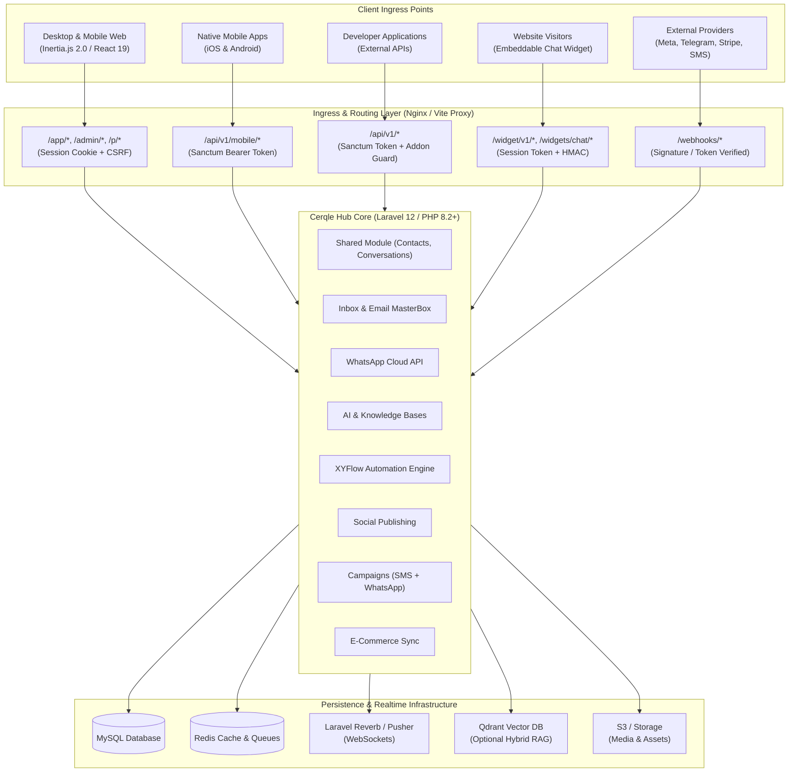
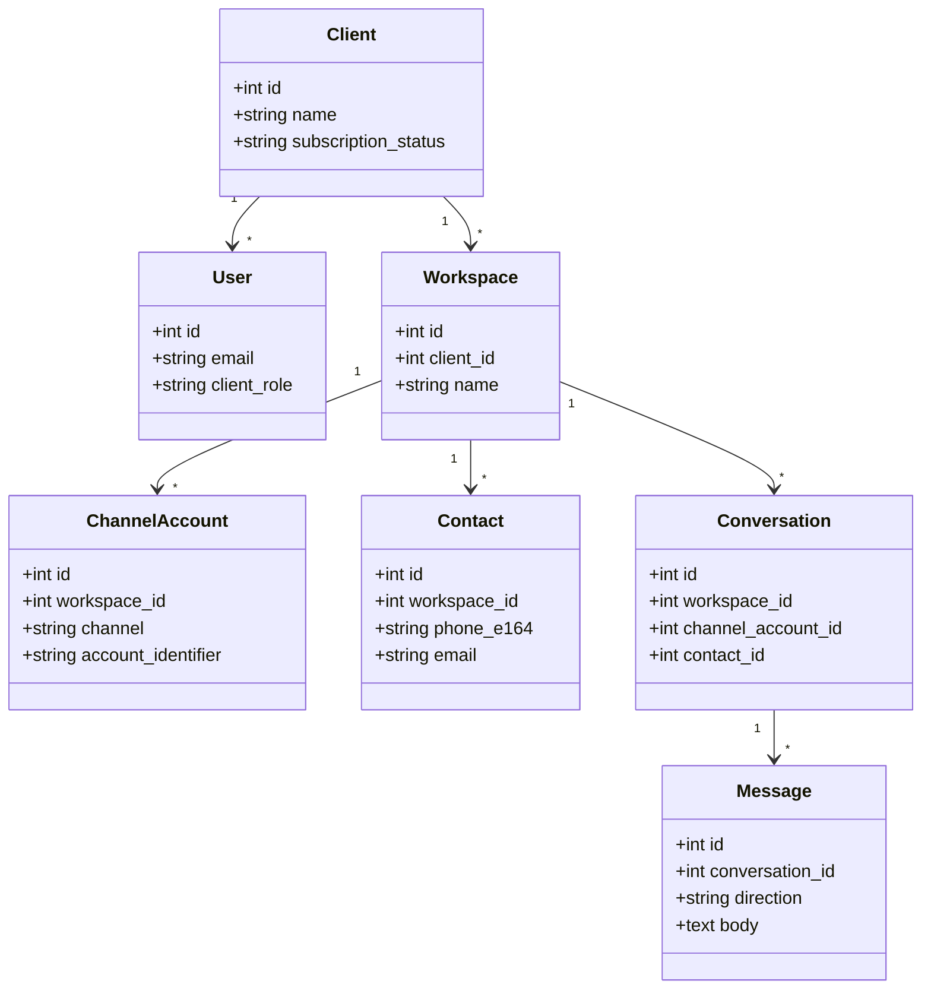
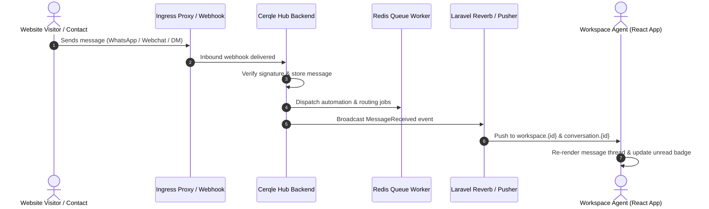

# Cerqle Hub — Technical Architecture Specification

This document defines the mandatory structural patterns, layer boundaries, multi-tenancy models, event pipelines, and quality standards for **Cerqle Hub**. All backend and frontend implementations must strictly adhere to these specifications.

---

## 1. System Boundary & Network Ingress



### Architectural Invariants
Smart Bot answering is workspace-scoped and generation-pinned. `ai_kb_generations` represents immutable published retrieval snapshots; `ai_knowledge_bases.active_generation_id` is the only generation eligible for answers, while `pending_generation_id` is never queried. Reindexing copies the active snapshot, replaces the target document inside a pending generation, and activates it transactionally only after extraction/embedding succeeds. Qdrant and MySQL filters include the generation. Business-aware routing and hybrid retrieval have independent rollout flags. Existing bots retain General scope; new bots default Business-only. Missing business profile data downgrades Business-only to Verified-only. Account/order data is never injected into model context. `ChatbotRunner::run()` and `runForApi()` remain compatible while structured origin/mode/citation/handoff metadata is additive. Grouped AI persists that metadata on the outbound message; public widgets receive only sanitized citations and controls.

Smart Bot language handling (2026-09-20) ships no phrase tables and no locale list. One zero-credit embedding per turn is computed by `Smart\QueryEmbedder` and shared by intent classification, choice matching and retrieval. `Smart\IntentClassifier` compares that vector against English exemplars — semantic seeds in a multilingual embedding space, not translations — behind length, punctuation and numeral guards, and stands down to the existing English matching when no embedding provider is configured. `Smart\CannedPhrases` translates a fixed set of English seeds once per language and caches them for 90 days; that cache is global because its contents derive from Cerqle-owned constants plus a language tag, while query embeddings, search translations and label vectors stay workspace-scoped because they derive from customer text. Both go through `LlmGateway::chatUnmetered()`, which writes an `AiRun` and no `AiCreditUsage`, guarded by an allow-list, a zero rate, a 60-token cap and its own limiter that — unlike `AiCreditService::reserve()` — also applies to queued jobs. `conversations.ai_language` stores the BCP-47 tag the model reports; before one exists the phrase generator is shown the customer's own message, and a Unicode script property serves only as a cache key, never as a reply language.

`Inbox\HandoverIntent` resolves "this customer wants a person" in three tiers: the existing English phrases, then a choice whose server-assigned role is `handoff`, then intent. Tier three is forbidden on the synchronous inbound path, because `AutoReplyListener` runs inside the visitor's own send request. Choices carry `{id,label,role}`; only server-authored fallbacks may mint `handoff`, and `Smart\ChoiceRenderer` appends a numbered list (max three) on channels that cannot render buttons, which `Smart\ChoiceResolver` reads back in any digit system. `Inbox\AgentAvailability` answers "are we open?" from `chat_widgets.working_hours_json` and active membership only — notification availability remains excluded as a presence signal. `AiReplyEligibility::humanOwned()` keeps the bot answering while a handover is unanswered and nobody is available, and stands it down on the first human reply. `inbound_reply_ownerships.reason_code`, `WidgetAiAvailability::reason()` and `ai_answer_diagnostics` make every silent turn explainable; `available()` is defined as `reason() === null` so the two cannot drift.

Website AI availability belongs to `chat_widgets`: `ai_mode`, `ai_timezone`, `ai_weekly_hours` and `ai_revision`, separate from team `working_hours_json` and grouped inbox AI settings. Existing CRUD validates tenant-owned enabled bots, schedules and revision conflicts; updates lock the widget and increment its revision atomically with account metadata. Webchat routing resolves the originating widget and pins widget ID/revision/bot in the shared AI job; availability is rechecked at receipt, generation and send. Old unpinned webchat jobs fail closed. Weekly interval validation detects overnight/Sunday wrap overlaps. Shared schedule evaluation supports multiple windows without changing grouped one-window behavior. Public config and visitor send/poll responses expose mode/active only, not private hours or bot identity; polling refreshes availability and suppresses misleading AI typing. No external calls are made outside eligible hours.

Website embed and customer mobile SDK access share one `ChatWidget` and `webchat` channel account but use separate public keys and gates. `widget_key` plus `enabled` governs `/widgets/chat/{key}.js` and website `/widget/v1/*` calls; `sdk_widget_key` plus `sdk_enabled` governs customer SDK `/widget/v1/*` calls. The per-widget website loader is never cached because its availability is mutable, and the static runtime keeps the launcher hidden until session access succeeds; a later disabled-session response removes an already loaded launcher. SDK requests do not use browser Origin/Referer allowlists. Existing website keys are unchanged, old SDK builds using them retain legacy website-gated behavior, and a website-key visitor token may be exchanged only against the same widget's SDK key during migration. New conversations record nullable `conversations.started_from` as `web_widget` or `customer_sdk`; existing rows stay null and restores never rewrite the original source. Channel remains `webchat`, so inbox routing, ownership, AI, handoff and reporting contracts remain compatible. Realtime and AI availability use the recorded source's gate.

Grouped inbox AI uses `workspace_ai_automation_settings` (unique workspace/group, optimistic revision, activation timestamp) and `inbound_reply_ownerships` (unique inbound message, workspace/conversation/account and durable attempt state). Both MessageReceived listener entry points delegate to the same ownership pipeline; registration order cannot result in both a workflow and AI reply. Human ownership/request → waiting/matched workflow → reply rule → AI. `GenerateGroupedAiReply` runs on `ai`, uses a shared per-conversation overlap lock and atomic queued→generating claim, and never retries an ambiguous sending attempt. Retried interrupted attempts become delivery-review entries. Settings changes cancel older revisions; legacy account links are honored only without a group row. Job timeout is capped at 120 seconds and ten seconds below connection retry_after; overlap expiry is 180 seconds. Production release checks must verify actual worker/connection timing. Workspace/conversation deletion purges reply receipts. Migration does not rewrite workflows, bots or account metadata.

Inbox media delivery is route-owned and workspace-scoped. Browser previews use the authenticated `client.inbox.message-media` route. Authenticated mobile serialization issues short-lived signed URLs at `api.v1.mobile.conversations.messages.media.signed`; the public fetch validates the signature and conversation/message binding, while the original Sanctum route remains available for compatibility. Stored widget/staff uploads retain their internal storage path, while WhatsApp and Meta provider media is fetched lazily, cached by message ID and then streamed privately. Meta remote fetches require an explicit normalized Meta attachment, an HTTPS Meta-owned hostname and `PublicHttpClient` validation. HEIC/HEIF conversion uses Imagick or the same bounded server-binary fallback chain as uploads; when no converter exists, the original remains a document instead of being discarded. Media-only list previews are response-level labels and do not rewrite message bodies or remove real captions.

Outbound provider image preparation is shared by staff web and mobile. Actual JPEG/PNG bytes pass through; HEIC/HEIF, WebP and GIF become JPEGs without rewriting captions. WhatsApp uses temporary conversions and the conversation-bound phone number for upload/send; Messenger and Instagram use persisted provider-safe JPEG URLs. Configurable converter paths support different hosts, and asynchronous Meta delivery errors are retained in `messages.error_json`.

`LICENSE_VERIFY` is an operator-controlled switch in every environment, defaulting to true. Explicit false disables license checks without altering authentication, tenancy or subscription enforcement. The owner explicitly restored this pre-2026-09-15 behavior after production ignored its existing false setting. Never copy production license files or credentials into a demo. See `docs/decisions/2026-09-15-configuration-controlled-licensing.md`.

1. **Strict Dual Authentication Boundaries**: 
   - Browser web sessions use Laravel session cookies with CSRF token verification.
   - Mobile apps and external developer APIs use Laravel Sanctum Bearer tokens.
2. **Encrypted Credentials**: External API keys, OAuth refresh tokens, and provider secrets are encrypted in the database (`Crypt::encryptString`) and never returned unmasked to the browser.
3. **Public Widget Isolation**: Visitor conversations from `/widget/v1/*` are pinned to a unique session token. Unsigned identities remain anonymous; signed identities require server-side HMAC validation (`hash_hmac`).
4. **Idempotent Webhook Processing**: Inbound webhooks (`/webhooks/*`) undergo cryptographic signature verification and payload deduplication before dispatching jobs onto background queues.
5. **Single Event Registration**: Laravel automatically discovers typed handler methods in `app/Listeners`. Do not also register those handlers with `Event::listen` in an application service provider; verify `php artisan event:list` reports each listener once so one inbound event cannot create duplicate automation runs, notifications, or outbound webhook deliveries.

### Security boundaries (2026-09-15)

- `ClientLoginService` applies active user/client checks and the same ten-minute second-factor challenge to password, magic-link, Socialite and Firebase browser login. `SecondFactorService` locks the user when consuming a recovery code. Mobile login returns `202 two_factor_required` without a token until the caller repeats credentials with `two_factor_code`. Authentication middleware rechecks persisted account state for web/admin/Sanctum requests; user deactivation revokes tokens, database sessions and remember tokens. MFA secrets/recovery codes are hidden from generic user serialization; the dedicated authenticated setup screen retains its intended setup/recovery display.
- `FirebaseIdTokenVerifier` accepts only RS256 signatures from Google's fixed Secure Token certificate endpoint, exact configured project audience/issuer, valid subject/timestamps and a verified valid email. A bounded certificate cache prevents hostile unknown-key fetch loops. Generic Google token-info responses do not authorize Firebase login. Production HTTP certificate verification cannot be disabled by `HTTP_VERIFY_SSL=false`.
- Sanctum stateful browser API requests use session cookies and CSRF. Restricted developer tokens retain resource-specific scopes, but cannot mint/manage tokens or use full-agent mobile, broadcast, profile or notification APIs. These operations require a full-access `*` token or a CSRF-protected first-party session. Non-super administrators cannot grant roles or modify admin accounts beyond their own authority. The owner explicitly deferred changing `view_clients` impersonation/plan assignment; do not represent this exception as least privilege.
- Unsigned `logged_in` widget metadata does not grant stable external-customer identity or transcript restoration. Trusted external IDs require the widget's enabled HMAC verification and nonempty secret. Anonymous visitor identifiers/session tokens remain bearer secrets and must be high-entropy; this change does not replace the public widget protocol.
- Media, attachment and branding storage extensions derive from file content, not client filenames. Active/unknown file types get a non-executable `.bin` extension. Knowledge-base API file ingestion requires a new validated upload rather than a caller-selected existing storage path. Existing uploaded objects are not rewritten or retroactively inventoried by this migration.
- `PublicUrlGuard` and `PublicHttpClient` protect caller-controlled knowledge URLs/sitemaps, automation/developer webhooks and WooCommerce requests. Require HTTP(S), no embedded credentials, valid ports and exclusively public DNS answers. Recheck/pin DNS with cURL while preserving hostname/TLS, disable environment proxies, force certificate verification, and bound streamed response bodies. Nonstandard public ports remain supported. Credential-bearing mutations do not follow redirects; the credential-free indexer follows at most three, validating each destination. IPv4 private/reserved/shared ranges and IPv6 local/mapped/transition/documentation ranges are rejected. This is not a replacement for production egress controls.
- Sitemap ingestion rejects XML DTD/entities, uses `LIBXML_NONET`, pins a root crawl ID, caps children at 200 across nested sitemaps and stops nesting at depth three. Root-row locking and same-KB URL deduplication prevent repeated expansion. Additive document columns default legacy roots to depth zero.
- `ecommerce_oauth_attempts` stores hashed single-use ten-minute Woo callback capabilities bound to actor/workspace/store; a public store UUID is not authorization. Actor activity/membership is rechecked before accepting credentials. Shopify session state also pins actor, workspace and expiry. Reconnect candidates are tested before replacing working stored credentials. Old in-flight Woo callbacks must restart; existing connected stores are preserved.
- `db:backup` uses argument-array `Process`, environment-only MySQL password, bounded-memory gzip streaming and explicit dump exit checks. Files are created in a private 0700 directory with 0600 mode. `--no-upload` and upload failure retain the private local artifact; only successful private upload removes it. Public disks are rejected. No real dump/restore is implied by mocked tests.

See `docs/security-hardening-qa-2026-09-15.md` and `docs/decisions/2026-09-15-security-boundaries-and-deferred-client-permissions.md` for evidence and remaining release checks.

---

## 2. Directory Structure & Module Hierarchy

Cerqle Hub implements a **Modular Monolith** architecture where distinct business domains are isolated within `app/Modules/`, combined with an Inertia/React frontend.

```text
cerqle-hub/
├── app/
│   ├── Console/Commands/        # System maintenance, license checks, cron tasks
│   ├── Http/
│   │   ├── Controllers/         # Platform, admin, and client root controllers
│   │   ├── Middleware/          # Tenancy, Addon verification, 2FA, Sanctum
│   │   └── Requests/            # Form validation requests
│   ├── Models/                  # Core tenancy models (User, Client, Workspace, Plan)
│   ├── Modules/                 # Domain Vertical Slices (Self-contained)
│   │   ├── AI/                  # Smart bots, knowledge bases, vector search, providers
│   │   ├── Automation/          # Visual workflow engine, triggers, actions, runs
│   │   ├── Broadcasting/        # SMS gateways, campaigns, delivery tracking
│   │   ├── Ecommerce/           # Shopify, WooCommerce, BigCommerce store sync
│   │   ├── Inbox/               # Omni-channel inbox, email masterbox, chat widgets
│   │   ├── Integrations/        # Shared OAuth foundations & encrypted settings
│   │   ├── Leads/               # Core lead data layer
│   │   ├── Shared/              # Contacts, conversations, messages, channel accounts
│   │   ├── Social/              # Social media OAuth, post composer, scheduler
│   │   └── Whatsapp/            # WABA management, cloud templates, auto-replies
│   ├── Providers/               # Service providers (Module discovery, Broadcast channels)
│   └── Services/                # Cross-cutting services (Stripe, Licensing, Storage)
├── resources/
│   ├── js/
│   │   ├── Components/          # Shared React UI & domain composites
│   │   │   ├── ui/              # Design system primitives (Button, Modal, Drawer, Badge)
│   │   │   ├── Inbox/           # Conversation cards, chat thread, message bubbles
│   │   │   └── Charts/          # Analytics & telemetry visualizations
│   │   ├── Layouts/             # ClientLayout, InboxLayout, AdminLayout, AuthLayout
│   │   ├── Pages/               # Inertia page components organized by feature
│   │   ├── hooks/               # Custom hooks (useOneSignal, useEcho, useDebounce)
│   │   ├── locales/             # i18n translation bundles
│   │   └── app.jsx              # Frontend application entry point
│   └── views/                   # Root Blade template (app.blade.php)
├── routes/
│   ├── admin.php                # Super Admin routes
│   ├── api.php                  # Mobile & developer REST API routes
│   ├── auth.php                 # Authentication & password recovery routes
│   ├── channels.php             # Private WebSocket channel definitions
│   ├── client.php               # Client account, workspace, settings & billing routes
│   ├── web.php                  # Marketing landing, CMS, and health probes
│   └── webhooks.php             # Provider callback endpoints
└── tests/
    ├── Feature/                 # Integration tests for HTTP endpoints & workflows
    └── Unit/                    # Pure unit tests for domain logic & helpers
```

---

## 3. Multi-Tenancy & Workspace Data Scoping

Cerqle Hub enforces strict **Logical Workspace Isolation** across all persistence, background processing, and real-time messaging layers:



### Tenancy Enforcement Invariants
Web and mobile email bulk resolution share `EmailBulkResolveService`. Web uses the active session workspace; mobile uses the token user's selected `workspace_id`. The service verifies an explicit mailbox belongs to that workspace and is email, then conditionally updates only open email conversations in that scope. `resolved_at` is set only when absent. The mobile thread response includes `counts.open` independent of search/folder pagination.

Conversation ownership/status actions use `ConversationActivityService`: the shared conversation AI/reply cache lock plus a workspace-scoped row lock and database transaction persist the state change and `messages.direction=system`, `type=event`, `sent_by=system` record together. Actor ID and name are snapshotted in `payload.activity`; no provider ID or `MessageSent`/`MessageReceived` event is created. Join opens the conversation. `workspace_member_availabilities` is the dedicated takeover schedule: administrators may always take over, while staff must be available and the current owner unavailable; missing/disabled schedules mean always available. This is separate from notification availability. Staff realtime uses `ConversationActivityCreated` for timeline history and state-only `ConversationOwnershipChanged` on private workspace/conversation channels. Widget session/poll and `WidgetMessageCreated` expose only joined/resolved activity (transfer becomes joined) with actor name but no internal user ID. Activity does not change `last_message_at`, unread, inbox preview, AI history, notifications, provider sends, or billing. Staff replies from web, mobile conversation, mobile email, and product sharing require the current joined owner and recheck ownership under the same cache lock immediately before creating the outbound message. Staff mobile conversation and email-thread detail/history APIs include system activity records; conversation detail also exposes `joined_at`, `joined_user`, and actor-specific `can_takeover`. The Developer API continues to return only `in/out` messages. The Flutter repository remains unchanged, so native rendering/adoption is a separate app release. The customer SDK remains separately owned and is not released here.

Browser `DELETE /app/inbox/conversations/{uuid}` and Sanctum mobile `DELETE /api/v1/mobile/conversations/{uuid}` share `ConversationDeletionService`: lock and recheck workspace ownership, purge dependent chat records transactionally, unlink retained AI usage history, and delete the conversation. Mobile returns 204 on success and 404 for missing/foreign chats. Existing subscription/demo write guards apply. This action makes no provider deletion request and does not delete contacts or shared media assets.

1. **Mandatory Query Scoping**: Every database lookup must scope by the active `workspace_id`.
2. **Channel Asset Exclusivity**: A provider account (e.g. WhatsApp Phone Number ID, Facebook Page ID, Instagram Account ID) is bound exclusively to a single `workspace_id` to prevent cross-tenant message contamination.
3. **Queue Job Hydration**: Queue jobs pass database IDs (not full serialized models) and re-verify tenant ownership at execution time.
4. **WebSocket Authorization**: Channel authorization rules in `BroadcastChannelsServiceProvider` authenticate the active user's workspace membership before granting access to `workspace.{id}` or `conversation.{id}` channels.
5. **Explicit Membership**: Sharing a `client_id` does not by itself grant workspace or realtime-channel access. Access requires ownership, primary/current workspace assignment, or an explicit workspace membership pivot.
6. **Permanent Workspace Deletion**: `WorkspaceDeletionService` deletes workspace-scoped and dependent records atomically, reassigns affected users to an accessible fallback workspace, and refuses to delete the client's only workspace. The browser action requires the exact workspace name as confirmation.
7. **Subscription access boundary**: `client.access` is enforced on client web modules and operational APIs. Verified users with an active or trialing organization subscription have full access; users without a plan remain in the dashboard/settings/subscription shell; expired subscriptions permit safe reads but reject writes and outbound work. Social publishing, campaign launch, and automation-trigger jobs re-check this state at execution time. Inbound provider webhooks remain available so customer data is not lost while billing is inactive.
8. **Permanent client deletion**: `ClientDeletionService` purges client users, workspaces, and operational data after exact-name confirmation. It retains only anonymized payment and audit history, so the deleted users' email addresses become reusable. `clients:purge-orphans` is dry-run by default and repairs legacy client deletions only with `--execute`.

---

## 4. Asynchronous Queues & Background Processing

Background jobs are categorized into dedicated queues to prevent high-volume operations (e.g. bulk SMS broadcasting) from blocking time-sensitive operations (e.g. inbound chat routing):

| Queue Name | Purpose | Worker Priority | Examples |
| :--- | :--- | :--- | :--- |
| `default` | General tenant operations, email sync, notifications | Normal (3) | `SyncEmailAccountJob`, `SendNotificationJob`, `DataExportJob` |
| `whatsapp` | Inbound & outbound WhatsApp, Meta Messenger, Instagram | High (1) | `ProcessInboundWhatsAppMessageJob`, `ProcessMetaWebhookJob` |
| `ai` | Document chunking, vector embedding, smart bot execution | Normal (2) | `IndexKnowledgeDocumentJob`, `GenerateAiResponseJob` |
| `social` | Scheduled social media post publishing | Normal (3) | `PublishSocialPostJob`, `ConfirmSocialPostProcessingJob`, `PurgeTemporarySocialMediaJob`, `RefreshSocialTokensJob` |

Social publishing stores a backward-compatible shared payload plus optional per-network overrides. Uploaded social media is explicitly linked to its post, remains quota-counted while a draft/schedule/retry needs it, and is released only after every selected destination succeeds. `PurgeTemporarySocialMediaJob` runs hourly on the `social` queue and deletes eligible files after 24 hours; external URLs and permanent Media Library assets are never lifecycle-managed by this job.

Short-lived YouTube, TikTok, and LinkedIn (both `linkedin` and `linkedin_page`) access tokens are renewed from their encrypted persistent refresh tokens by `SocialAccessTokenService`. `RefreshSocialTokensJob` checks tokens within ten minutes of expiry every ten minutes on the `social` queue, while publish, processing-check, edit, delete, account-status, and TikTok creator-option paths also refresh just in time. Refreshes use a per-account lock to avoid concurrent rotation. A transient provider failure is logged and retried without deleting or deactivating the client connection; deployments must preserve `APP_KEY`, the integration credential records, and `social_media_accounts` token records. Google OAuth projects with an external audience and `Testing` publishing status impose a provider-side seven-day refresh-token lifetime for YouTube scopes; persistent public connections therefore require the production OAuth publishing/verification path.

YouTube OAuth requests `https://www.googleapis.com/auth/youtube.force-ssl`, the narrowest single scope that covers Cerqle's authenticated channel lookup, video upload and processing checks, custom thumbnails, playlist placement, metadata updates, and explicit remote deletion. Cerqle does not request the broader `https://www.googleapis.com/auth/youtube` account-management scope.
| `broadcast` | SMS and WhatsApp campaign preparation, paced dispatch, retries and finalisation | Low (4) | campaign preparation, pump and send jobs |
 | `automation` | XYFlow workflow execution, delayed continuation and reply timeout | High (1) | `ExecuteAutomationRunJob` |
| `ecommerce` | Store catalog, order, and customer syncing | Low (4) | `SyncStoreOrdersJob`, `ProcessShopifyWebhookJob` |

Production provisions dedicated `broadcast` workers so failures or sustained
traffic on `default` cannot starve campaign delivery. WhatsApp schedules recover
automatically only within `WHATSAPP_CAMPAIGN_STALE_SCHEDULE_SECONDS` (15 minutes by
default). Older queued schedules enter `safety_paused` and require review before
resume, preventing a repaired worker from unexpectedly releasing stale marketing
messages. Creating or rescheduling a queued campaign also persists a delayed
`LaunchCampaignJob` directly on Redis; the every-minute
`LaunchScheduledCampaignsJob` scanner is a recovery fallback rather than the
primary timing mechanism. Concurrent fallback and delayed launches share a
per-campaign overlap lock, and an obsolete delayed job exits if the campaign has
since been moved to a future time. The two scheduler maintenance jobs are unique
for up to one hour while pending, preventing a stopped worker from accumulating
one duplicate per minute. Production deployment disables the exact legacy
twelve-process `cerqle-broadcast` Supervisor group, provisions two dedicated
workers, and fails unless both repository-managed workers report `RUNNING`.

Campaign delivery keeps Meta's structured WhatsApp rejection details in JSON logs
while showing a safer operator-facing explanation. Meta code `131009` is a generic
invalid-parameter response: recipient-specific details may identify an invalid or
unregistered WhatsApp number, but the code alone must not be presented as proof
because invalid message and template values can produce the same code.
Meta error `138000` indicates a selected template contains a voice-call button
while Calling is unavailable for the sending phone. Bulk campaigns reject
`VOICE_CALL` templates during validation; the template remains available for
other WhatsApp workflows. Media headers remain template-defined: an approved
`IMAGE`, `VIDEO`, or `DOCUMENT` header requires one matching parameter per send,
while header-free templates require no media.

Campaign cloning is workspace-authorized and always creates a draft. It copies
configuration and delivery-step definitions, but never recipient rows, queue
state, provider progress, totals, failure history, or schedule timestamps. CSV
audiences are copied to a new workspace-scoped storage path so either campaign
can be edited or deleted independently.

---

## 5. Integrations & External Service Contracts

### X native publishing primitives

The registered `twitter` driver uses system `oauth_twitter` credentials. X OAuth
uses PKCE S256 and single-use session attempts bound to user, original workspace,
application ID and ten-minute expiry. The callback rechecks workspace membership.
Encrypted tokens refresh through the existing per-account lock and ten-minute
refresh job; changing the app Client ID requires reconnect, while disabling the
integration suppresses outbound work without removing account rows.

`XDestinationPublisher` persists encrypted payload/media state and review history
in the additive `x_publish_attempts` table. Payloads are pinned per destination;
shared and override media IDs survive IDs-only API requests. Existing plan limits
remain unchanged. Actual file inspection runs before upload and again before
create; permanent library assets are linked but never released/purged as temporary
uploads. `ffprobe` must be installed for video validation, which fails closed.
Upload readiness is checked again after inspection to handle expiry boundaries.
Publishing and provider-confirmation jobs share a per-post non-overlap lock.
The durable `creating` state becomes `unknown` on abandoned execution rather than
replaying. Explicit review verifies a supplied post ID's author or authorizes a
new attempt with a duplicate warning, archiving prior encrypted attempt evidence.
Explicit X disconnect clears tokens and tombstones the account via `disconnected_at`,
preserving uncertain/published receipts while excluding it from connected inventory.
Reconnect restores the same identity; restoring a disconnected row rechecks capacity
under the existing usage lock. Other networks retain their existing deletion behavior.
Result aggregation counts only current destinations, retaining removed destinations'
history without letting old failures poison the current outcome. Immediate browser
creation persists `publishing` before dispatching its job.

`XDriver` reads `/2/users/me` with username/profile-picture fields and creates
`/2/tweets` using text and `x_media_ids`, never media URLs. Create has no automatic
HTTP retries. `XProviderException` exposes sanitized `category`, `retryAfter`
(seconds, honoring the later Retry-After/reset up to 86400), and `outcome` (`definite` or `unknown`).
Create connection errors, 5xx, and successful responses missing an ID are unknown
(`category` and `outcome` both `unknown`) and must enter delivery review rather than automatic replay. 401 requires reconnect;
403 distinguishes credit/permission failures without exposing provider details.

`XMediaUploader::advance(account, localMediaIds, state)` performs at most one
initialize/append/finalize/status request. State contains `uploads` keyed by local
Media ID (provider `id`, `expires_at`, offset/segment, stage, optional next-check
timestamp), aggregate `stage` (`uploading`, `processing`, `ready`), `retry_after`
seconds and ordered provider `media_ids` only when ready. Media must be linked to a
post in the account's workspace. Stored files are read through Storage readStream;
append sends one bounded raw-binary multipart chunk, never an external URL.
The main attempt orchestrator owns encrypted state persistence, credential refresh
before every stage, scheduling, and create claims. It must call advance immediately
before create: sessions expiring within 30 seconds are reinitialized. These primitives
are wired into the registered X destination workflow.
Provider references: [append](https://docs.x.com/x-api/media/append-media-upload),
[initialize](https://docs.x.com/x-api/media/initialize-media-upload),
[finalize](https://docs.x.com/x-api/media/finalize-media-upload), and
[status](https://docs.x.com/x-api/media/get-media-upload-status).

### WhatsApp coexistence client-wide availability (updated 2026-09-15)

Connection onboarding uses the installation-wide `WHATSAPP_COEXISTENCE_ENABLED`
switch, available to every client when enabled. `WHATSAPP_COEXISTENCE_WORKSPACES`
is retired and ignored, including stale server values. Workspace-default sends
delegate to the explicit phone factory, retaining ownership, active-WABA and
Business-app-disconnection checks. PHPUnit forces SQLite `:memory:` and the testing
environment so inherited local database variables cannot target persistent data.

The implementation was initially deployed in release v1.0.82 with a scoped pilot.
The owner approved removing that availability restriction on 2026-09-15. Meta's
September 10 review was observed approved/renewed for the WhatsApp permissions;
successful number onboarding and end-to-end messaging remain unverified. See
`PROJECT_STATUS.md` for the dated operational checkpoint.

The signup session listener captures Meta events for the whole OAuth interaction;
its 15-second grace period starts only after the code callback. Explicit CANCEL,
ERROR, and mismatched connection-mode events fail closed instead of invoking
standard registration. Only a standard-flow missing-event timeout retains the
legacy server discovery fallback. The session utility understands the documented
`FINISH_WHATSAPP_BUSINESS_APP_ONBOARDING` event. The separate coexistence option is
shown to all clients; it is disabled with an explanation when the global switch is off.

`WhatsappDriver` sends only the `messages` field to live message/status ingestion.
History media can also contain a `messages` array: it must never enter that path
and trigger consent changes, AI, or live notifications. History and contact sync
are intentionally not imported in the pilot. Mobile-app echoes have a separate
HMAC-gated durable ingress, encrypted receipts, and idempotent WhatsApp queue job.

`WhatsappCoexistenceController` provides separate begin/store routes. It
binds a single-use attempt to the actor, workspace and expiry; number entry occurs
only in Meta. It verifies token app/scopes and phone membership/mode through Graph.
An optional returned phone ID must match that verified list; without an ID, exactly
one eligible coexistence phone is required. Ambiguous discovery fails closed.
Reauthorization can begin at capacity; new identities still undergo model quota
enforcement inside the billing-account lock. The controller never calls
registration/deregistration or prunes other phones. New onboarding/import config
flags default off, without a workspace allowlist. `CoexistenceMessageStore`
is connected only to the mobile-app echo ingress (not historical import):
its persistence tests cover history consent, phone/WABA/workspace scoping,
duplicates, media enrichment, and mobile-app human takeover. Echo receipts are
stored before acknowledgement and recovered by the scheduler. The send boundary rejects imported
and mobile-app-origin messages and rechecks current human assignment before bot
sends. It cannot retract a provider request already in flight.

The additive migration introduces phone `connection_mode`/`coexistence_meta` and
message `origin`. The WhatsApp service-window query excludes `whatsapp_history`,
is scoped to the conversation's channel account, and rejects future timestamps.
The migration and query change were deployed with the guarded implementation.
Provider-side onboarding and end-to-end validation remain incomplete.

See `WHATSAPP_COEXISTENCE.md` for verified provider contracts and rollout gates.

Cerqle Hub integrates with multiple third-party providers with resilient fallback mechanisms:

Instagram DM inbound/echo attachment types are derived from `message.attachments`, while the original webhook payload remains intact. The web inbox reads every nested attachment, including legacy rows saved as text: image/video/audio previews use HTTPS provider URLs; shares and unknown attachment types use safe links. Expired/missing URLs show an unavailable state. No server-side fetch of arbitrary attachment URLs is introduced, and Instagram attachments do not use the WhatsApp media proxy or album grouping. Provider-hosted URLs are not guaranteed to remain available indefinitely.

| Integration | Protocol / Transport | Purpose | Architectural Rules |
| :--- | :--- | :--- | :--- |
| **WhatsApp Cloud API** | Graph API / Webhooks | WABA messaging, template syncing | Webhooks verified via `hub.verify_token`. Inbound payloads processed on `whatsapp` queue. |
| **Meta (FB & IG)** | Graph API / OAuth 2.0 | Page inbox, Instagram DM, Post publishing | Granular `target_ids` used for asset binding. Post deletion respects provider capability. |
| **Google Sign-In** | OAuth 2.0 / OpenID Connect | Browser authentication | Login and signup have separate intent. Login never provisions an unknown account; an unknown Google identity is redirected to the terms-gated registration screen. Signup requires Terms acceptance, may preserve a selected plan, and trusts only Google's verified-email claim. Provider identifiers link the Cerqle user account. Callback validation failures return a prominent OAuth alert with retry and account-creation guidance, while unexpected provider exceptions are reported server-side. Returned access and refresh tokens use encrypted model casts and unbounded text columns so provider credential length cannot break the callback. |
| **Telegram Business** | Bot API / Webhooks | Inbound updates & agent replies | Webhook secret token verified on arrival. |
| **Email (Gmail/M365/IMAP)** | OAuth 2.0 / IMAP & SMTP | Master Email Inbox synchronization | Sync worker runs every minute; multi-mailbox support per workspace. |
| **AI Providers** | REST / SSE Streaming | Knowledge retrieval, smart bot generation | Supports OpenAI, Anthropic, Gemini, and DeepSeek. DeepSeek provides cost-efficient RAG answer generation through its OpenAI-compatible Chat Completions API; because it has no native embeddings API, document indexing and retrieval use configured OpenAI/Gemini workspace credentials (which need not be the active chat provider) or a system embedding provider. MySQL fallback for vectors; optional Qdrant. |
| **SMS Gateways** | REST / HTTP Callbacks | Bulk SMS campaigns | Pluggable gateway adapters (Twilio, MessageBird, SMSBD, REVE, BulkSMS, ProSMS, SNS). |
| **Payment Gateways** | Webhooks / SDKs | Subscriptions, add-ons, invoices | Stripe, PayPal, and Paddle supported with signature validation. |

Transactional system email uses the active encrypted SMTP configuration and an email-client-safe Cerqle layout with a plain-text alternative. Verification delivery failures are logged and may fall back to Laravel notifications, but a provider or recipient rejection must not roll back an already-created user account.

Mailbox persistence from Gmail/Microsoft OAuth callbacks and IMAP/SMTP setup passes through `EmailAccountLimitService`. The service serializes capacity checks and upserts in a database transaction on the client row (or standalone workspace owner). Remote credential verification happens outside the lock. `limits.email_accounts` counts all email channel-account rows across that billing account's workspaces, including inactive connections. OAuth capacity is checked at callback persistence, allowing reconnect at capacity and handling slots consumed during consent. No-plan accounts have zero new-mailbox capacity. Disconnect removes the row and frees a slot; no migration or automatic plan-price mapping is needed for this JSON limit.

---

## 6. Real-Time Event & Broadcasting Architecture

Real-time browser and mobile synchronization is powered by **Laravel Reverb** (default) or **Pusher Protocol** paired with **Laravel Echo**:



### Channel Authorization Schemes
Internal notes store plain text with empty mention IDs for new notes; no teammate lookup or mention notification dispatch occurs. Preserve historical note bodies and mention metadata. Existing notification classes remain for legacy compatibility.
- **Workspace notification bell (2026-09-07)**: `WorkspaceNotifications` scopes browser/API notification lists, counts, read/delete actions, and read-all to the recipient and an accessible active workspace using `data.workspace_id`. Browser scope uses the session selection; token API scope uses `users.workspace_id`. Inertia counts use its validated workspace selection. Workspace notification producers persist the source entity's workspace, never the recipient's currently selected workspace. Both client layouts filter user-channel broadcasts before showing toasts or incrementing counts; the bell clears cached items on workspace switches and discards stale responses. Unscoped legacy/account-wide notifications are retained but excluded from this workspace-only surface; email and external push delivery/preferences are unchanged.

- **Personal work-notification delivery availability (2026-09-13)**: The eight scoped work notifications (new message, assignment, note mention, handover, pending reply, campaign completion, automation failure and export ready) capture source workspace and occurrence time in their constructors; new messages use message `created_at`. `RespectsWorkspaceAvailability` pins initial availability per recipient during `via()` before queue clones are made. `NotificationDeliveryPolicy` checks fresh user membership/status and existing preferences at send, preserves database history for accessible workspaces, and requires both initial and current availability for external mail/OneSignal/WebPush delivery. Notifications originating outside hours or dispatched while paused never catch up after resume. Broadcasts remain available for synchronization with `silent` metadata calculated at construction and rechecked by the actual broadcast worker; once silent, a queued broadcast cannot become noisy. The worker also rechecks membership and broadcast preference. `NotificationDeliveryServiceProvider` guards `NotificationSending` and final SMTP `MessageSending`; custom push channels guard provider calls directly. Scoped exports follow this policy, while legacy exports constructed without a workspace and account/security/billing notifications retain their existing delivery behavior.
- All eight work-notification `toArray()` payloads also persist additive `silent` metadata for database history/API consumers. This records the delivery-time policy result; historical rows are not rewritten after availability changes. Missing source scope fails closed rather than falling back to a recipient's selected workspace; explicitly unscoped legacy exports remain compatible.
- Availability settings use a unique user/workspace row with mode, timezone, weekly JSON hours and revision; no row means Always. Personal GET uses browser session or Sanctum selected workspace and returns `can_edit`; personal PATCH requires active client-administrator status. Team GET/PATCH `/app/team/{member}/workspaces/{workspace}/notification-availability` requires an active client administrator, matching actor/member/workspace client and explicit member ownership/membership. Staff cannot write any availability. Saves lock the target user, recheck authorization and enforce revisions; existing schedules are preserved. Export requests pin the originating workspace before queueing; old unpinned export jobs skip. The schedule evaluator is shared with AI but settings are independent.
- **`workspace.{workspaceId}`**: Accessible by active workspace members. Carries unread count updates, new conversation alerts, and presence status.
- **`conversation.{conversationId}`**: Accessible only if the user belongs to the owning workspace. Carries live message bubbles and typing indicators.
- **`widget.session.{sessionToken}`**: Public visitor channel scoped by secure session token for website chat.

---

## 7. Health Monitoring & Observability

### Shared channel quota enforcement (2026-09-07)

`ChannelPlanLimitService` and `EnforcesChannelPlanLimit` serialize resource saves on the billing client row (standalone accounts use the owner user). `ChannelAccount`, `SocialAccount`, `ChatWidget`, and `WhatsappWidget` enforce capacity on creation/transfer; ordinary edits and token renewal are unaffected. Identity lookups inside the lock handle concurrent reauthorization. Website widget/channel creation and WhatsApp phone/channel attachment are transactional. Do not introduce query-builder inserts or bulk upserts that bypass these model saves.

`MessagingMessageLimitService` reserves `messaging_quota_periods` before provider I/O, keyed by billing `account_key` and `Ym` period. This account-level counter survives workspace deletion and contains only aggregate counts, not message content. WhatsApp enforcement is in `CloudApiClient::post`, covering direct API/campaign callers; Messenger and Instagram enforce each message in their private transport wrapper. No network call holds the quota database lock. Definitive failure refunds use the original account/period even at month rollover or workspace deletion; ambiguous HTTP connection errors retain the reservation. This is capacity accounting, not provider-delivery idempotency: never automatically replay a send with uncertain delivery. `UsageMeter::track` now uses `firstOrCreate` so subsequent increments cannot reset prior usage.

Inertia's `channel_plan_usage` exposes organization counts (not other workspaces' identities). Resource limits and message limits are independent from email, AI credits, and website-chat usage. Migration `2026_09_07_130000_unify_messaging_plan_limits` preserves legacy plan keys for rollback while introducing the new keys and current-month usage baseline; it deliberately never deletes usage on rollback.

Cerqle Hub includes health and readiness endpoints protected by `HEALTHZ_TOKEN`:

- `GET /healthz/db`: Validates active database connection and query readiness.
- `GET /healthz/redis`: Validates Redis ping and cache latency.
- `GET /healthz/queue`: Validates queue worker backlog and queue driver status.

---

## 8. Quality Gates & Testing Strategy

```text
                     ┌───────────────────────────┐
                     │   End-to-End Workflows    │
                     │  (Browser & API Testing)  │
                     └─────────────┬─────────────┘
                                   │
                     ┌─────────────┴─────────────┐
                     │   Integration / Feature   │
                     │  (HTTP, Webhooks, Queues) │
                     └─────────────┬─────────────┘
                                   │
                     ┌─────────────┴─────────────┐
                     │     Unit & Component      │
                     │ (PHPUnit, Vitest, Libs)   │
                     └───────────────────────────┘
```

### Verification Commands
- **Backend Linting**: `./vendor/bin/pint --test`
- **Backend Static Analysis**: `./vendor/bin/phpstan analyse --memory-limit=512M`
- **Backend Automated Tests**: `php artisan test --parallel`
- **Frontend Automated Tests**: `npm test`
- **Frontend Linting & Formatting**: `npm run lint && npm run format`
- **Production Asset Build**: `npm run build`

---

## 9. Change Management Checklists

### Adding a New Integration Channel
- [ ] Implement channel driver under `app/Modules/<Module>/Services/`.
- [ ] Add webhook endpoint in `routes/webhooks.php` with signature verification.
- [ ] Map provider asset IDs to `channel_accounts` table scoped by `workspace_id`.
- [ ] Add channel brand icon in `resources/js/Components/BrandIcons.jsx`.
- [ ] Add unit and feature tests covering message ingestion and token refresh.

### Adding an Automation Node Type
- [ ] Define node type and category in `resources/js/Pages/Automation/Builder.jsx`.
- [ ] Implement backend execution logic in `app/Modules/Automation/Services/AutomationEngine.php` and shared `WorkflowValidator` rules.
- [ ] Add translation keys for node label and description in `resources/js/locales/`.
- [ ] Verify node serialization and execution flow with a feature test.
### Automation execution boundary (2026-09-13)

New inbound runs capture `workflow_snapshot`, `conversation_id`, `channel_account_id` and `trigger_message_id`. Snapshots are immutable execution inputs; live workflow status, subscription, chat ownership, human assignment, consent and connection state remain safety checks. Trigger creation uses a chat-scoped cache lock and a unique automation/message database key. Reply consumption locks the waiting run and writes a durable unique automation/message receipt before queueing continuation. One pending/running/waiting interaction per automation/chat prevents overlapping greetings. Reply receipts persist across multiple questions.

`automation_step_claims` uniquely claims run/node attempts before side effects. Duplicate claims fail closed for delivery review instead of resending ambiguous requests; this is not an exactly-once provider guarantee. Queue overlap protection serializes a run. `wake_at` and delayed job `expectedWake` prevent obsolete jobs from advancing resumed runs. Migration cancels unsnapshotted legacy waiting/running runs; pending legacy runs snapshot before first execution. Workspace purge removes claims and reply receipts.

Builder activation/preview share `WorkflowValidator`; draft saving applies structural checks only. Status-only pause remains available for legacy flows. Template choices expose WABA identity, not credentials, and are sender-matched during validation and sending. Free-form sends reuse `Conversation::isWhatsappWindowOpen`, excluding imported history and future provider timestamps. See `docs/decisions/2026-09-13-whatsapp-first-automations.md` and `docs/automation-sqa.md`.

### Local analytics compatibility (2026-09-07)

`AnalyticsService::campaignDeliveryOverTime` groups recipient timestamps by hour using SQLite `strftime` locally and MySQL `DATE_FORMAT` in production. Both return the same `YYYY-MM-DD HH:00` buckets; authorization and campaign scoping remain in the callers.

### Static analysis contracts (2026-09-07)

Deployment follows the `spiderman` → fast-forward `dev` → approved merge `main` workflow recorded in `AGENTS.md` and `DEPLOYMENT.md`. Production synchronizes to a fetched `origin/main` commit under a deploy lock; it retains a recovery ref, repairs only history-only divergence, and stops on actual server-only changes or local-file collisions. It never creates server merge commits. Release recording occurs after build/migration/worker checks, not during the deployment build hook.

PHPStan remains at level 6. `phpstan.neon` scans both `database/migrations` and `app/Modules/*/database/migrations`, and enables `parseModelCastsMethod` for Laravel's `casts()` declarations. Relationship return types identify both related and declaring models. Remove baseline entries only when their errors are confirmed absent; do not generate new suppressions to obtain a passing check. See `PHPSTAN_CLEANUP.md` for the current audit checkpoint.

Messenger's pending Page-selection session retains its user authorization token server-side until the selection is consumed. It is used only to fetch a missing Page token; the user token is never returned in the selection response or substituted for a Page credential. Legacy pending selections without either token skip the Page without making an unauthenticated Graph request.

The `ai-runs` rate limiter loads `client.activeSubscription.plan` and invokes `Client::activePlan()` as a method, not an Eloquent relationship.

# Managed AI credits (2026-09-02)

New workspace provider settings default to `auto_fallback` (2026-09-07). Explicitly saved preferences and legacy enabled BYOK configurations remain unchanged. The header credit indicator links to `client.ai.providers.index`. Fallback requires usable client credentials; the default does not enable hard credit enforcement.

All production text generation passes through `App\Modules\AI\Services\LlmGateway`; direct provider calls are limited to the zero-credit provider connection test. The gateway requires a centrally configured `feature_key`, selects the workspace mode (`managed`, `byok`, or `auto_fallback`), and records `ai_runs` plus an immutable `ai_credit_usages` ledger entry. Unknown managed feature keys fail closed.

Credits are pooled by organization (`client_id`) or, for a standalone subscription, by the subscription owner. `ai_credit_periods` uses the subscription anniversary as its monthly anchor, including annual subscriptions. Reservations are locked in a database transaction before inference, finalized once after a successful user-visible response, and refunded after provider failure. `reconcile-ai-credit-reservations` refunds reservations abandoned for more than ten minutes. Idempotency keys are workspace-prefixed and completed results are encrypted for safe retry replay.

Managed inference uses the system OpenAI integration and internally routes routine features to `gpt-5-nano`, complex content/planning features to `gpt-5-mini`, and embeddings to `text-embedding-3-small`. Customer-owned keys never fall back to a system generation key in BYOK mode. DeepSeek is BYOK-only. Embeddings are zero-credit infrastructure: a configured customer OpenAI/Gemini embedding key takes precedence, followed by the managed embedding service.

`AI_CREDITS_ENFORCED=false` is shadow mode and is the safe initial rollout value. It records demand without blocking. Production may set it to `true` only after ledger reconciliation confirms that there are no unmetered generation paths. Missing or null `ai_credits_per_month` always means zero managed credits, not unlimited.

Stored successful AI responses are reconstructed through `LlmResponse::fromStoredResult`, which validates content/model strings and integer usage/latency fields. The credit-usage ID comes from the ledger row, never from the saved payload. Malformed results fail explicitly rather than being replayed as a successful completion.
