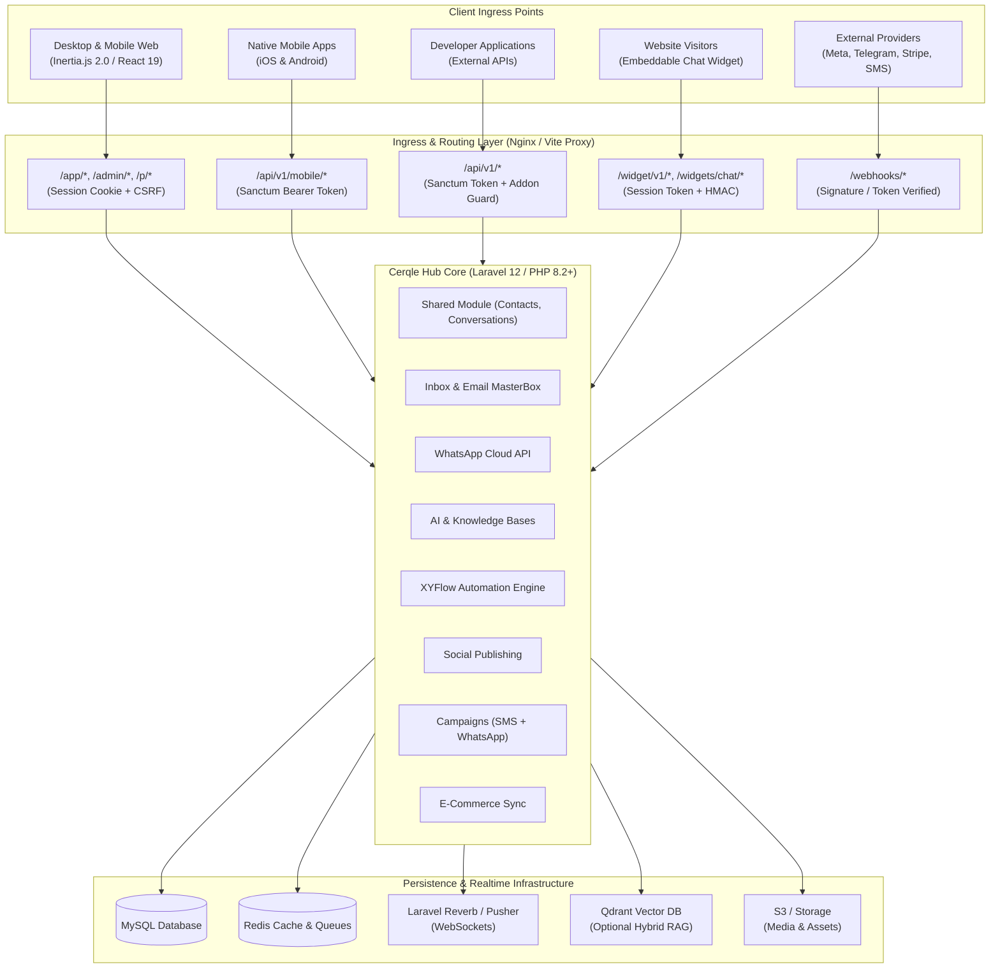
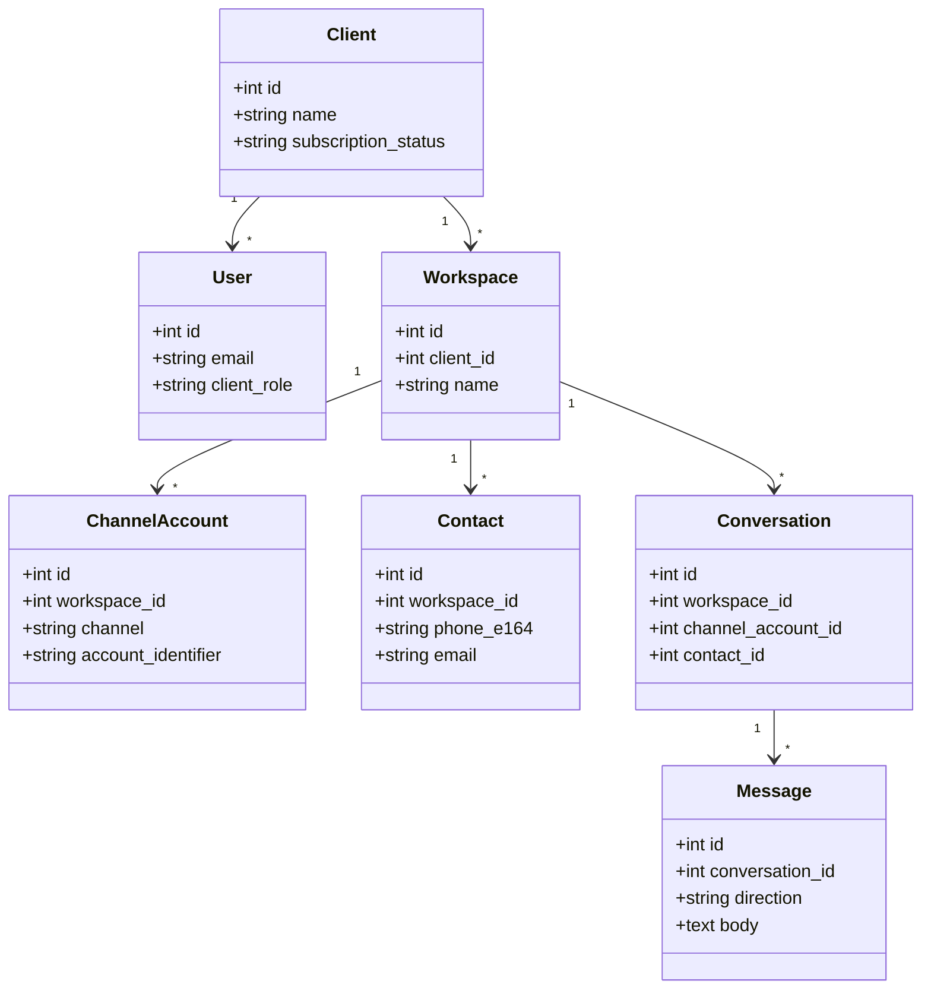
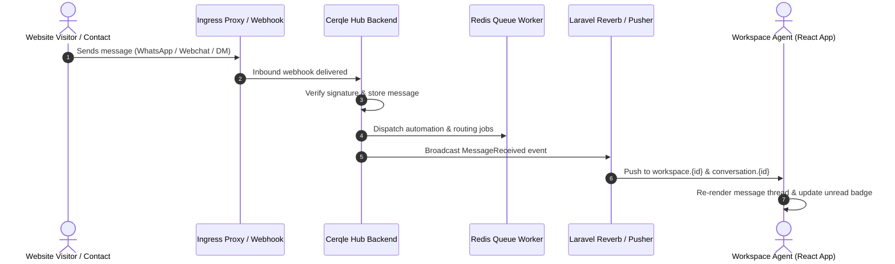

# Cerqle Hub — Technical Architecture Specification

This document defines the mandatory structural patterns, layer boundaries, multi-tenancy models, event pipelines, and quality standards for **Cerqle Hub**. All backend and frontend implementations must strictly adhere to these specifications.

---

## 1. System Boundary & Network Ingress



### Architectural Invariants
1. **Strict Dual Authentication Boundaries**: 
   - Browser web sessions use Laravel session cookies with CSRF token verification.
   - Mobile apps and external developer APIs use Laravel Sanctum Bearer tokens.
2. **Encrypted Credentials**: External API keys, OAuth refresh tokens, and provider secrets are encrypted in the database (`Crypt::encryptString`) and never returned unmasked to the browser.
3. **Public Widget Isolation**: Visitor conversations from `/widget/v1/*` are pinned to a unique session token. Unsigned identities remain anonymous; signed identities require server-side HMAC validation (`hash_hmac`).
4. **Idempotent Webhook Processing**: Inbound webhooks (`/webhooks/*`) undergo cryptographic signature verification and payload deduplication before dispatching jobs onto background queues.
5. **Single Event Registration**: Laravel automatically discovers typed handler methods in `app/Listeners`. Do not also register those handlers with `Event::listen` in an application service provider; verify `php artisan event:list` reports each listener once so one inbound event cannot create duplicate automation runs, notifications, or outbound webhook deliveries.

---

## 2. Directory Structure & Module Hierarchy

Cerqle Hub implements a **Modular Monolith** architecture where distinct business domains are isolated within `app/Modules/`, combined with an Inertia/React frontend.

```text
cerqle-hub/
├── app/
│   ├── Console/Commands/        # System maintenance, license checks, cron tasks
│   ├── Http/
│   │   ├── Controllers/         # Platform, admin, and client root controllers
│   │   ├── Middleware/          # Tenancy, Addon verification, 2FA, Sanctum
│   │   └── Requests/            # Form validation requests
│   ├── Models/                  # Core tenancy models (User, Client, Workspace, Plan)
│   ├── Modules/                 # Domain Vertical Slices (Self-contained)
│   │   ├── AI/                  # Smart bots, knowledge bases, vector search, providers
│   │   ├── Automation/          # Visual workflow engine, triggers, actions, runs
│   │   ├── Broadcasting/        # SMS gateways, campaigns, delivery tracking
│   │   ├── Ecommerce/           # Shopify, WooCommerce, BigCommerce store sync
│   │   ├── Inbox/               # Omni-channel inbox, email masterbox, chat widgets
│   │   ├── Integrations/        # Shared OAuth foundations & encrypted settings
│   │   ├── Leads/               # Core lead data layer
│   │   ├── Shared/              # Contacts, conversations, messages, channel accounts
│   │   ├── Social/              # Social media OAuth, post composer, scheduler
│   │   └── Whatsapp/            # WABA management, cloud templates, auto-replies
│   ├── Providers/               # Service providers (Module discovery, Broadcast channels)
│   └── Services/                # Cross-cutting services (Stripe, Licensing, Storage)
├── resources/
│   ├── js/
│   │   ├── Components/          # Shared React UI & domain composites
│   │   │   ├── ui/              # Design system primitives (Button, Modal, Drawer, Badge)
│   │   │   ├── Inbox/           # Conversation cards, chat thread, message bubbles
│   │   │   └── Charts/          # Analytics & telemetry visualizations
│   │   ├── Layouts/             # ClientLayout, InboxLayout, AdminLayout, AuthLayout
│   │   ├── Pages/               # Inertia page components organized by feature
│   │   ├── hooks/               # Custom hooks (useOneSignal, useEcho, useDebounce)
│   │   ├── locales/             # i18n translation bundles
│   │   └── app.jsx              # Frontend application entry point
│   └── views/                   # Root Blade template (app.blade.php)
├── routes/
│   ├── admin.php                # Super Admin routes
│   ├── api.php                  # Mobile & developer REST API routes
│   ├── auth.php                 # Authentication & password recovery routes
│   ├── channels.php             # Private WebSocket channel definitions
│   ├── client.php               # Client account, workspace, settings & billing routes
│   ├── web.php                  # Marketing landing, CMS, and health probes
│   └── webhooks.php             # Provider callback endpoints
└── tests/
    ├── Feature/                 # Integration tests for HTTP endpoints & workflows
    └── Unit/                    # Pure unit tests for domain logic & helpers
```

---

## 3. Multi-Tenancy & Workspace Data Scoping

Cerqle Hub enforces strict **Logical Workspace Isolation** across all persistence, background processing, and real-time messaging layers:



### Tenancy Enforcement Invariants
1. **Mandatory Query Scoping**: Every database lookup must scope by the active `workspace_id`.
2. **Channel Asset Exclusivity**: A provider account (e.g. WhatsApp Phone Number ID, Facebook Page ID, Instagram Account ID) is bound exclusively to a single `workspace_id` to prevent cross-tenant message contamination.
3. **Queue Job Hydration**: Queue jobs pass database IDs (not full serialized models) and re-verify tenant ownership at execution time.
4. **WebSocket Authorization**: Channel authorization rules in `BroadcastChannelsServiceProvider` authenticate the active user's workspace membership before granting access to `workspace.{id}` or `conversation.{id}` channels.
5. **Explicit Membership**: Sharing a `client_id` does not by itself grant workspace or realtime-channel access. Access requires ownership, primary/current workspace assignment, or an explicit workspace membership pivot.
6. **Permanent Workspace Deletion**: `WorkspaceDeletionService` deletes workspace-scoped and dependent records atomically, reassigns affected users to an accessible fallback workspace, and refuses to delete the client's only workspace. The browser action requires the exact workspace name as confirmation.
7. **Subscription access boundary**: `client.access` is enforced on client web modules and operational APIs. Verified users with an active or trialing organization subscription have full access; users without a plan remain in the dashboard/settings/subscription shell; expired subscriptions permit safe reads but reject writes and outbound work. Social publishing, campaign launch, and automation-trigger jobs re-check this state at execution time. Inbound provider webhooks remain available so customer data is not lost while billing is inactive.
8. **Permanent client deletion**: `ClientDeletionService` purges client users, workspaces, and operational data after exact-name confirmation. It retains only anonymized payment and audit history, so the deleted users' email addresses become reusable. `clients:purge-orphans` is dry-run by default and repairs legacy client deletions only with `--execute`.

---

## 4. Asynchronous Queues & Background Processing

Background jobs are categorized into dedicated queues to prevent high-volume operations (e.g. bulk SMS broadcasting) from blocking time-sensitive operations (e.g. inbound chat routing):

| Queue Name | Purpose | Worker Priority | Examples |
| :--- | :--- | :--- | :--- |
| `default` | General tenant operations, email sync, notifications | Normal (3) | `SyncEmailAccountJob`, `SendNotificationJob`, `DataExportJob` |
| `whatsapp` | Inbound & outbound WhatsApp, Meta Messenger, Instagram | High (1) | `ProcessInboundWhatsAppMessageJob`, `ProcessMetaWebhookJob` |
| `ai` | Document chunking, vector embedding, smart bot execution | Normal (2) | `IndexKnowledgeDocumentJob`, `GenerateAiResponseJob` |
| `social` | Scheduled social media post publishing | Normal (3) | `PublishSocialPostJob`, `ConfirmSocialPostProcessingJob`, `PurgeTemporarySocialMediaJob`, `RefreshSocialTokensJob` |

Social publishing stores a backward-compatible shared payload plus optional per-network overrides. Uploaded social media is explicitly linked to its post, remains quota-counted while a draft/schedule/retry needs it, and is released only after every selected destination succeeds. `PurgeTemporarySocialMediaJob` runs hourly on the `social` queue and deletes eligible files after 24 hours; external URLs and permanent Media Library assets are never lifecycle-managed by this job.

Short-lived YouTube, TikTok, and LinkedIn access tokens are renewed from their encrypted persistent refresh tokens by `SocialAccessTokenService`. `RefreshSocialTokensJob` checks tokens within ten minutes of expiry every ten minutes on the `social` queue, while publish, processing-check, edit, delete, account-status, and TikTok creator-option paths also refresh just in time. Refreshes use a per-account lock to avoid concurrent rotation. A transient provider failure is logged and retried without deleting or deactivating the client connection; deployments must preserve `APP_KEY`, the integration credential records, and `social_media_accounts` token records. Google OAuth projects with an external audience and `Testing` publishing status impose a provider-side seven-day refresh-token lifetime for YouTube scopes; persistent public connections therefore require the production OAuth publishing/verification path.

YouTube OAuth requests `https://www.googleapis.com/auth/youtube.force-ssl`, the narrowest single scope that covers Cerqle's authenticated channel lookup, video upload and processing checks, custom thumbnails, playlist placement, metadata updates, and explicit remote deletion. Cerqle does not request the broader `https://www.googleapis.com/auth/youtube` account-management scope.
| `broadcast` | SMS and WhatsApp campaign preparation, paced dispatch, retries and finalisation | Low (4) | campaign preparation, pump and send jobs |
| `automation` | XYFlow visual workflow step evaluation & execution | High (1) | `ExecuteAutomationStepJob`, `ResumeDelayedAutomationJob` |
| `ecommerce` | Store catalog, order, and customer syncing | Low (4) | `SyncStoreOrdersJob`, `ProcessShopifyWebhookJob` |

Production provisions dedicated `broadcast` workers so failures or sustained
traffic on `default` cannot starve campaign delivery. WhatsApp schedules recover
automatically only within `WHATSAPP_CAMPAIGN_STALE_SCHEDULE_SECONDS` (15 minutes by
default). Older queued schedules enter `safety_paused` and require review before
resume, preventing a repaired worker from unexpectedly releasing stale marketing
messages. Creating or rescheduling a queued campaign also persists a delayed
`LaunchCampaignJob` directly on Redis; the every-minute
`LaunchScheduledCampaignsJob` scanner is a recovery fallback rather than the
primary timing mechanism. Concurrent fallback and delayed launches share a
per-campaign overlap lock, and an obsolete delayed job exits if the campaign has
since been moved to a future time. The two scheduler maintenance jobs are unique
for up to one hour while pending, preventing a stopped worker from accumulating
one duplicate per minute. Production deployment disables the exact legacy
twelve-process `cerqle-broadcast` Supervisor group, provisions two dedicated
workers, and fails unless both repository-managed workers report `RUNNING`.

---

## 5. Integrations & External Service Contracts

### WhatsApp coexistence guarded pilot (updated 2026-09-11)

The implementation was deployed in release v1.0.82 and rollout was last recorded
as enabled only for one allowlisted pilot workspace. Meta onboarding remains
externally blocked by Advanced Access error 2655111; no successful phone connection
or end-to-end coexistence validation has been recorded. See `PROJECT_STATUS.md` for
the dated operational checkpoint.

The signup session listener captures Meta events for the whole OAuth interaction;
its 15-second grace period starts only after the code callback. Explicit CANCEL,
ERROR, and mismatched connection-mode events fail closed instead of invoking
standard registration. Only a standard-flow missing-event timeout retains the
legacy server discovery fallback. The session utility understands the documented
`FINISH_WHATSAPP_BUSINESS_APP_ONBOARDING` event. The separate coexistence option is
exposed only when rollout is enabled for the active workspace.

`WhatsappDriver` sends only the `messages` field to live message/status ingestion.
History media can also contain a `messages` array: it must never enter that path
and trigger consent changes, AI, or live notifications. History and contact sync
are intentionally not imported in the pilot. Mobile-app echoes have a separate
HMAC-gated durable ingress, encrypted receipts, and idempotent WhatsApp queue job.

`WhatsappCoexistenceController` provides separate begin/store routes. It
binds a single-use attempt to the actor, workspace and expiry; number entry occurs
only in Meta. It verifies token app/scopes and phone membership/mode through Graph.
An optional returned phone ID must match that verified list; without an ID, exactly
one eligible coexistence phone is required. Ambiguous discovery fails closed.
Reauthorization can begin at capacity; new identities still undergo model quota
enforcement inside the billing-account lock. The controller never calls
registration/deregistration or prunes other phones. New onboarding/import config
flags default off, with an optional workspace allowlist. `CoexistenceMessageStore`
is connected only to the mobile-app echo ingress (not historical import):
its persistence tests cover history consent, phone/WABA/workspace scoping,
duplicates, media enrichment, and mobile-app human takeover. Echo receipts are
stored before acknowledgement and recovered by the scheduler. The send boundary rejects imported
and mobile-app-origin messages and rechecks current human assignment before bot
sends. It cannot retract a provider request already in flight.

The additive migration introduces phone `connection_mode`/`coexistence_meta` and
message `origin`. The WhatsApp service-window query excludes `whatsapp_history`,
is scoped to the conversation's channel account, and rejects future timestamps.
The migration and query change were deployed with the guarded implementation.
Provider-side onboarding and end-to-end validation remain incomplete.

See `WHATSAPP_COEXISTENCE.md` for verified provider contracts and rollout gates.

Cerqle Hub integrates with multiple third-party providers with resilient fallback mechanisms:

Instagram DM inbound/echo attachment types are derived from `message.attachments`, while the original webhook payload remains intact. The web inbox reads every nested attachment, including legacy rows saved as text: image/video/audio previews use HTTPS provider URLs; shares and unknown attachment types use safe links. Expired/missing URLs show an unavailable state. No server-side fetch of arbitrary attachment URLs is introduced, and Instagram attachments do not use the WhatsApp media proxy or album grouping. Provider-hosted URLs are not guaranteed to remain available indefinitely.

| Integration | Protocol / Transport | Purpose | Architectural Rules |
| :--- | :--- | :--- | :--- |
| **WhatsApp Cloud API** | Graph API / Webhooks | WABA messaging, template syncing | Webhooks verified via `hub.verify_token`. Inbound payloads processed on `whatsapp` queue. |
| **Meta (FB & IG)** | Graph API / OAuth 2.0 | Page inbox, Instagram DM, Post publishing | Granular `target_ids` used for asset binding. Post deletion respects provider capability. |
| **Google Sign-In** | OAuth 2.0 / OpenID Connect | Browser authentication | Login and signup have separate intent. Login never provisions an unknown account; an unknown Google identity is redirected to the terms-gated registration screen. Signup requires Terms acceptance, may preserve a selected plan, and trusts only Google's verified-email claim. Provider identifiers link the Cerqle user account. Callback validation failures return a prominent OAuth alert with retry and account-creation guidance, while unexpected provider exceptions are reported server-side. Returned access and refresh tokens use encrypted model casts and unbounded text columns so provider credential length cannot break the callback. |
| **Telegram Business** | Bot API / Webhooks | Inbound updates & agent replies | Webhook secret token verified on arrival. |
| **Email (Gmail/M365/IMAP)** | OAuth 2.0 / IMAP & SMTP | Master Email Inbox synchronization | Sync worker runs every minute; multi-mailbox support per workspace. |
| **AI Providers** | REST / SSE Streaming | Knowledge retrieval, smart bot generation | Supports OpenAI, Anthropic, Gemini, and DeepSeek. DeepSeek provides cost-efficient RAG answer generation through its OpenAI-compatible Chat Completions API; because it has no native embeddings API, document indexing and retrieval use configured OpenAI/Gemini workspace credentials (which need not be the active chat provider) or a system embedding provider. MySQL fallback for vectors; optional Qdrant. |
| **SMS Gateways** | REST / HTTP Callbacks | Bulk SMS campaigns | Pluggable gateway adapters (Twilio, MessageBird, SMSBD, REVE, BulkSMS, ProSMS, SNS). |
| **Payment Gateways** | Webhooks / SDKs | Subscriptions, add-ons, invoices | Stripe, PayPal, and Paddle supported with signature validation. |

Transactional system email uses the active encrypted SMTP configuration and an email-client-safe Cerqle layout with a plain-text alternative. Verification delivery failures are logged and may fall back to Laravel notifications, but a provider or recipient rejection must not roll back an already-created user account.

Mailbox persistence from Gmail/Microsoft OAuth callbacks and IMAP/SMTP setup passes through `EmailAccountLimitService`. The service serializes capacity checks and upserts in a database transaction on the client row (or standalone workspace owner). Remote credential verification happens outside the lock. `limits.email_accounts` counts all email channel-account rows across that billing account's workspaces, including inactive connections. OAuth capacity is checked at callback persistence, allowing reconnect at capacity and handling slots consumed during consent. No-plan accounts have zero new-mailbox capacity. Disconnect removes the row and frees a slot; no migration or automatic plan-price mapping is needed for this JSON limit.

---

## 6. Real-Time Event & Broadcasting Architecture

Real-time browser and mobile synchronization is powered by **Laravel Reverb** (default) or **Pusher Protocol** paired with **Laravel Echo**:



### Channel Authorization Schemes
- **Workspace notification bell (2026-09-07)**: `WorkspaceNotifications` scopes browser/API notification lists, counts, read/delete actions, and read-all to the recipient and an accessible active workspace using `data.workspace_id`. Browser scope uses the session selection; token API scope uses `users.workspace_id`. Inertia counts use its validated workspace selection. Workspace notification producers persist the source entity's workspace, never the recipient's currently selected workspace. Both client layouts filter user-channel broadcasts before showing toasts or incrementing counts; the bell clears cached items on workspace switches and discards stale responses. Unscoped legacy/account-wide notifications are retained but excluded from this workspace-only surface; email and external push delivery/preferences are unchanged.
- **`workspace.{workspaceId}`**: Accessible by active workspace members. Carries unread count updates, new conversation alerts, and presence status.
- **`conversation.{conversationId}`**: Accessible only if the user belongs to the owning workspace. Carries live message bubbles and typing indicators.
- **`widget.session.{sessionToken}`**: Public visitor channel scoped by secure session token for website chat.

---

## 7. Health Monitoring & Observability

### Shared channel quota enforcement (2026-09-07)

`ChannelPlanLimitService` and `EnforcesChannelPlanLimit` serialize resource saves on the billing client row (standalone accounts use the owner user). `ChannelAccount`, `SocialAccount`, `ChatWidget`, and `WhatsappWidget` enforce capacity on creation/transfer; ordinary edits and token renewal are unaffected. Identity lookups inside the lock handle concurrent reauthorization. Website widget/channel creation and WhatsApp phone/channel attachment are transactional. Do not introduce query-builder inserts or bulk upserts that bypass these model saves.

`MessagingMessageLimitService` reserves `messaging_quota_periods` before provider I/O, keyed by billing `account_key` and `Ym` period. This account-level counter survives workspace deletion and contains only aggregate counts, not message content. WhatsApp enforcement is in `CloudApiClient::post`, covering direct API/campaign callers; Messenger and Instagram enforce each message in their private transport wrapper. No network call holds the quota database lock. Definitive failure refunds use the original account/period even at month rollover or workspace deletion; ambiguous HTTP connection errors retain the reservation. This is capacity accounting, not provider-delivery idempotency: never automatically replay a send with uncertain delivery. `UsageMeter::track` now uses `firstOrCreate` so subsequent increments cannot reset prior usage.

Inertia's `channel_plan_usage` exposes organization counts (not other workspaces' identities). Resource limits and message limits are independent from email, AI credits, and website-chat usage. Migration `2026_09_07_130000_unify_messaging_plan_limits` preserves legacy plan keys for rollback while introducing the new keys and current-month usage baseline; it deliberately never deletes usage on rollback.

Cerqle Hub includes health and readiness endpoints protected by `HEALTHZ_TOKEN`:

- `GET /healthz/db`: Validates active database connection and query readiness.
- `GET /healthz/redis`: Validates Redis ping and cache latency.
- `GET /healthz/queue`: Validates queue worker backlog and queue driver status.

---

## 8. Quality Gates & Testing Strategy

```text
                     ┌───────────────────────────┐
                     │   End-to-End Workflows    │
                     │  (Browser & API Testing)  │
                     └─────────────┬─────────────┘
                                   │
                     ┌─────────────┴─────────────┐
                     │   Integration / Feature   │
                     │  (HTTP, Webhooks, Queues) │
                     └─────────────┬─────────────┘
                                   │
                     ┌─────────────┴─────────────┐
                     │     Unit & Component      │
                     │ (PHPUnit, Vitest, Libs)   │
                     └───────────────────────────┘
```

### Verification Commands
- **Backend Linting**: `./vendor/bin/pint --test`
- **Backend Static Analysis**: `./vendor/bin/phpstan analyse --memory-limit=512M`
- **Backend Automated Tests**: `php artisan test --parallel`
- **Frontend Automated Tests**: `npm test`
- **Frontend Linting & Formatting**: `npm run lint && npm run format`
- **Production Asset Build**: `npm run build`

---

## 9. Change Management Checklists

### Adding a New Integration Channel
- [ ] Implement channel driver under `app/Modules/<Module>/Services/`.
- [ ] Add webhook endpoint in `routes/webhooks.php` with signature verification.
- [ ] Map provider asset IDs to `channel_accounts` table scoped by `workspace_id`.
- [ ] Add channel brand icon in `resources/js/Components/BrandIcons.jsx`.
- [ ] Add unit and feature tests covering message ingestion and token refresh.

### Adding an Automation Node Type
- [ ] Define node type and category in `resources/js/Pages/Automation/Builder.jsx`.
- [ ] Implement backend execution logic in `app/Modules/Automation/Services/AutomationRunner.php`.
- [ ] Add translation keys for node label and description in `resources/js/locales/`.
- [ ] Verify node serialization and execution flow with a feature test.
### Local analytics compatibility (2026-09-07)

`AnalyticsService::campaignDeliveryOverTime` groups recipient timestamps by hour using SQLite `strftime` locally and MySQL `DATE_FORMAT` in production. Both return the same `YYYY-MM-DD HH:00` buckets; authorization and campaign scoping remain in the callers.

### Static analysis contracts (2026-09-07)

Deployment follows the `spiderman` → fast-forward `dev` → approved merge `main` workflow recorded in `AGENTS.md` and `DEPLOYMENT.md`. Production synchronizes to a fetched `origin/main` commit under a deploy lock; it retains a recovery ref, repairs only history-only divergence, and stops on actual server-only changes or local-file collisions. It never creates server merge commits. Release recording occurs after build/migration/worker checks, not during the deployment build hook.

PHPStan remains at level 6. `phpstan.neon` scans both `database/migrations` and `app/Modules/*/database/migrations`, and enables `parseModelCastsMethod` for Laravel's `casts()` declarations. Relationship return types identify both related and declaring models. Remove baseline entries only when their errors are confirmed absent; do not generate new suppressions to obtain a passing check. See `PHPSTAN_CLEANUP.md` for the current audit checkpoint.

Messenger's pending Page-selection session retains its user authorization token server-side until the selection is consumed. It is used only to fetch a missing Page token; the user token is never returned in the selection response or substituted for a Page credential. Legacy pending selections without either token skip the Page without making an unauthenticated Graph request.

The `ai-runs` rate limiter loads `client.activeSubscription.plan` and invokes `Client::activePlan()` as a method, not an Eloquent relationship.

# Managed AI credits (2026-09-02)

New workspace provider settings default to `auto_fallback` (2026-09-07). Explicitly saved preferences and legacy enabled BYOK configurations remain unchanged. The header credit indicator links to `client.ai.providers.index`. Fallback requires usable client credentials; the default does not enable hard credit enforcement.

All production text generation passes through `App\Modules\AI\Services\LlmGateway`; direct provider calls are limited to the zero-credit provider connection test. The gateway requires a centrally configured `feature_key`, selects the workspace mode (`managed`, `byok`, or `auto_fallback`), and records `ai_runs` plus an immutable `ai_credit_usages` ledger entry. Unknown managed feature keys fail closed.

Credits are pooled by organization (`client_id`) or, for a standalone subscription, by the subscription owner. `ai_credit_periods` uses the subscription anniversary as its monthly anchor, including annual subscriptions. Reservations are locked in a database transaction before inference, finalized once after a successful user-visible response, and refunded after provider failure. `reconcile-ai-credit-reservations` refunds reservations abandoned for more than ten minutes. Idempotency keys are workspace-prefixed and completed results are encrypted for safe retry replay.

Managed inference uses the system OpenAI integration and internally routes routine features to `gpt-5-nano`, complex content/planning features to `gpt-5-mini`, and embeddings to `text-embedding-3-small`. Customer-owned keys never fall back to a system generation key in BYOK mode. DeepSeek is BYOK-only. Embeddings are zero-credit infrastructure: a configured customer OpenAI/Gemini embedding key takes precedence, followed by the managed embedding service.

`AI_CREDITS_ENFORCED=false` is shadow mode and is the safe initial rollout value. It records demand without blocking. Production may set it to `true` only after ledger reconciliation confirms that there are no unmetered generation paths. Missing or null `ai_credits_per_month` always means zero managed credits, not unlimited.

Stored successful AI responses are reconstructed through `LlmResponse::fromStoredResult`, which validates content/model strings and integer usage/latency fields. The credit-usage ID comes from the ledger row, never from the saved payload. Malformed results fail explicitly rather than being replayed as a successful completion.
