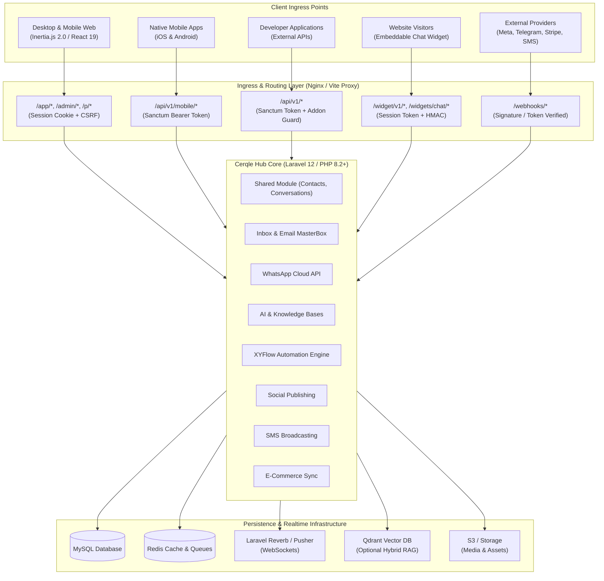
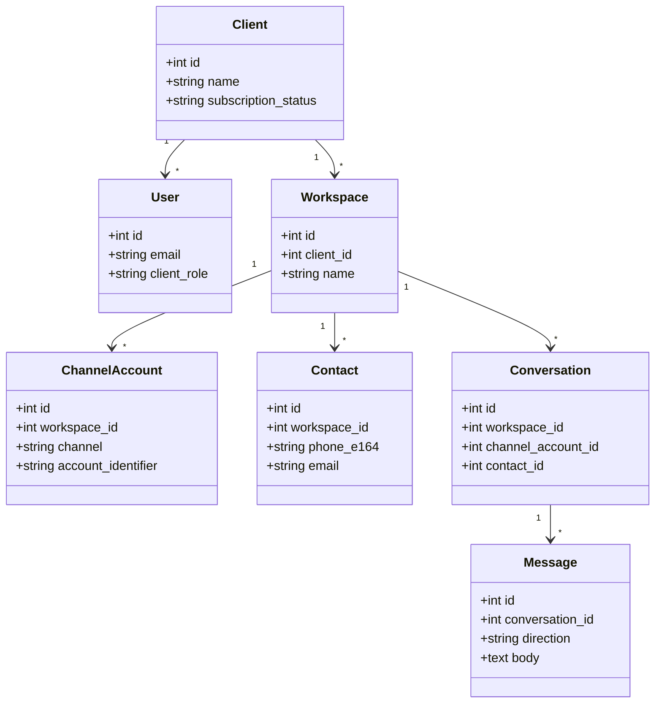
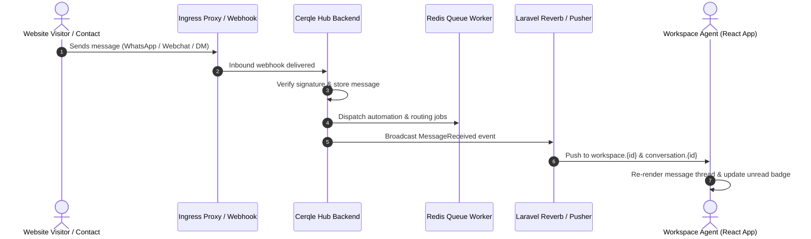

# Cerqle Hub — Technical Architecture Specification

This document defines the mandatory structural patterns, layer boundaries, multi-tenancy models, event pipelines, and quality standards for **Cerqle Hub**. All backend and frontend implementations must strictly adhere to these specifications.

---

## 1. System Boundary & Network Ingress



### Architectural Invariants
1. **Strict Dual Authentication Boundaries**: 
   - Browser web sessions use Laravel session cookies with CSRF token verification.
   - Mobile apps and external developer APIs use Laravel Sanctum Bearer tokens.
2. **Encrypted Credentials**: External API keys, OAuth refresh tokens, and provider secrets are encrypted in the database (`Crypt::encryptString`) and never returned unmasked to the browser.
3. **Public Widget Isolation**: Visitor conversations from `/widget/v1/*` are pinned to a unique session token. Unsigned identities remain anonymous; signed identities require server-side HMAC validation (`hash_hmac`).
4. **Idempotent Webhook Processing**: Inbound webhooks (`/webhooks/*`) undergo cryptographic signature verification and payload deduplication before dispatching jobs onto background queues.

---

## 2. Directory Structure & Module Hierarchy

Cerqle Hub implements a **Modular Monolith** architecture where distinct business domains are isolated within `app/Modules/`, combined with an Inertia/React frontend.

```text
cerqle-hub/
├── app/
│   ├── Console/Commands/        # System maintenance, license checks, cron tasks
│   ├── Http/
│   │   ├── Controllers/         # Platform, admin, and client root controllers
│   │   ├── Middleware/          # Tenancy, Addon verification, 2FA, Sanctum
│   │   └── Requests/            # Form validation requests
│   ├── Models/                  # Core tenancy models (User, Client, Workspace, Plan)
│   ├── Modules/                 # Domain Vertical Slices (Self-contained)
│   │   ├── AI/                  # Smart bots, knowledge bases, vector search, providers
│   │   ├── Automation/          # Visual workflow engine, triggers, actions, runs
│   │   ├── Broadcasting/        # SMS gateways, campaigns, delivery tracking
│   │   ├── Ecommerce/           # Shopify, WooCommerce, BigCommerce store sync
│   │   ├── Inbox/               # Omni-channel inbox, email masterbox, chat widgets
│   │   ├── Integrations/        # Shared OAuth foundations & encrypted settings
│   │   ├── Leads/               # Core lead data layer
│   │   ├── Shared/              # Contacts, conversations, messages, channel accounts
│   │   ├── Social/              # Social media OAuth, post composer, scheduler
│   │   └── Whatsapp/            # WABA management, cloud templates, auto-replies
│   ├── Providers/               # Service providers (Module discovery, Broadcast channels)
│   └── Services/                # Cross-cutting services (Stripe, Licensing, Storage)
├── resources/
│   ├── js/
│   │   ├── Components/          # Shared React UI & domain composites
│   │   │   ├── ui/              # Design system primitives (Button, Modal, Drawer, Badge)
│   │   │   ├── Inbox/           # Conversation cards, chat thread, message bubbles
│   │   │   └── Charts/          # Analytics & telemetry visualizations
│   │   ├── Layouts/             # ClientLayout, InboxLayout, AdminLayout, AuthLayout
│   │   ├── Pages/               # Inertia page components organized by feature
│   │   ├── hooks/               # Custom hooks (useOneSignal, useEcho, useDebounce)
│   │   ├── locales/             # i18n translation bundles
│   │   └── app.jsx              # Frontend application entry point
│   └── views/                   # Root Blade template (app.blade.php)
├── routes/
│   ├── admin.php                # Super Admin routes
│   ├── api.php                  # Mobile & developer REST API routes
│   ├── auth.php                 # Authentication & password recovery routes
│   ├── channels.php             # Private WebSocket channel definitions
│   ├── client.php               # Client account, workspace, settings & billing routes
│   ├── web.php                  # Marketing landing, CMS, and health probes
│   └── webhooks.php             # Provider callback endpoints
└── tests/
    ├── Feature/                 # Integration tests for HTTP endpoints & workflows
    └── Unit/                    # Pure unit tests for domain logic & helpers
```

---

## 3. Multi-Tenancy & Workspace Data Scoping

Cerqle Hub enforces strict **Logical Workspace Isolation** across all persistence, background processing, and real-time messaging layers:



### Tenancy Enforcement Invariants
1. **Mandatory Query Scoping**: Every database lookup must scope by the active `workspace_id`.
2. **Channel Asset Exclusivity**: A provider account (e.g. WhatsApp Phone Number ID, Facebook Page ID, Instagram Account ID) is bound exclusively to a single `workspace_id` to prevent cross-tenant message contamination.
3. **Queue Job Hydration**: Queue jobs pass database IDs (not full serialized models) and re-verify tenant ownership at execution time.
4. **WebSocket Authorization**: Channel authorization rules in `BroadcastChannelsServiceProvider` authenticate the active user's workspace membership before granting access to `workspace.{id}` or `conversation.{id}` channels.
5. **Explicit Membership**: Sharing a `client_id` does not by itself grant workspace or realtime-channel access. Access requires ownership, primary/current workspace assignment, or an explicit workspace membership pivot.
6. **Permanent Workspace Deletion**: `WorkspaceDeletionService` deletes workspace-scoped and dependent records atomically, reassigns affected users to an accessible fallback workspace, and refuses to delete the client's only workspace. The browser action requires the exact workspace name as confirmation.

---

## 4. Asynchronous Queues & Background Processing

Background jobs are categorized into dedicated queues to prevent high-volume operations (e.g. bulk SMS broadcasting) from blocking time-sensitive operations (e.g. inbound chat routing):

| Queue Name | Purpose | Worker Priority | Examples |
| :--- | :--- | :--- | :--- |
| `default` | General tenant operations, email sync, notifications | Normal (3) | `SyncEmailAccountJob`, `SendNotificationJob`, `DataExportJob` |
| `whatsapp` | Inbound & outbound WhatsApp, Meta Messenger, Instagram | High (1) | `ProcessInboundWhatsAppMessageJob`, `ProcessMetaWebhookJob` |
| `ai` | Document chunking, vector embedding, smart bot execution | Normal (2) | `IndexKnowledgeDocumentJob`, `GenerateAiResponseJob` |
| `social` | Scheduled social media post publishing | Normal (3) | `PublishSocialPostJob`, `ConfirmSocialPostProcessingJob`, `PurgeTemporarySocialMediaJob`, `RefreshSocialTokensJob` |

Social publishing stores a backward-compatible shared payload plus optional per-network overrides. Uploaded social media is explicitly linked to its post, remains quota-counted while a draft/schedule/retry needs it, and is released only after every selected destination succeeds. `PurgeTemporarySocialMediaJob` runs hourly on the `social` queue and deletes eligible files after 24 hours; external URLs and permanent Media Library assets are never lifecycle-managed by this job.

Short-lived YouTube, TikTok, and LinkedIn access tokens are renewed from their encrypted persistent refresh tokens by `SocialAccessTokenService`. `RefreshSocialTokensJob` checks tokens within ten minutes of expiry every ten minutes on the `social` queue, while publish, processing-check, edit, delete, account-status, and TikTok creator-option paths also refresh just in time. Refreshes use a per-account lock to avoid concurrent rotation. A transient provider failure is logged and retried without deleting or deactivating the client connection; deployments must preserve `APP_KEY`, the integration credential records, and `social_media_accounts` token records. Google OAuth projects with an external audience and `Testing` publishing status impose a provider-side seven-day refresh-token lifetime for YouTube scopes; persistent public connections therefore require the production OAuth publishing/verification path.

YouTube OAuth requests `https://www.googleapis.com/auth/youtube.force-ssl`, the narrowest single scope that covers Cerqle's authenticated channel lookup, video upload and processing checks, custom thumbnails, playlist placement, metadata updates, and explicit remote deletion. Cerqle does not request the broader `https://www.googleapis.com/auth/youtube` account-management scope.
| `broadcast` | Bulk SMS campaign batching & dispatching | Low (4) | `DispatchSmsBatchJob`, `ProcessSmsDeliveryCallbackJob` |
| `automation` | XYFlow visual workflow step evaluation & execution | High (1) | `ExecuteAutomationStepJob`, `ResumeDelayedAutomationJob` |
| `ecommerce` | Store catalog, order, and customer syncing | Low (4) | `SyncStoreOrdersJob`, `ProcessShopifyWebhookJob` |

---

## 5. Integrations & External Service Contracts

Cerqle Hub integrates with multiple third-party providers with resilient fallback mechanisms:

| Integration | Protocol / Transport | Purpose | Architectural Rules |
| :--- | :--- | :--- | :--- |
| **WhatsApp Cloud API** | Graph API / Webhooks | WABA messaging, template syncing | Webhooks verified via `hub.verify_token`. Inbound payloads processed on `whatsapp` queue. |
| **Meta (FB & IG)** | Graph API / OAuth 2.0 | Page inbox, Instagram DM, Post publishing | Granular `target_ids` used for asset binding. Post deletion respects provider capability. |
| **Google Sign-In** | OAuth 2.0 / OpenID Connect | Browser authentication | Provider identifiers link the Cerqle user account. Returned access and refresh tokens use encrypted model casts and unbounded text columns so provider credential length cannot break the callback. |
| **Telegram Business** | Bot API / Webhooks | Inbound updates & agent replies | Webhook secret token verified on arrival. |
| **Email (Gmail/M365/IMAP)** | OAuth 2.0 / IMAP & SMTP | Master Email Inbox synchronization | Sync worker runs every minute; multi-mailbox support per workspace. |
| **AI Providers** | REST / SSE Streaming | Knowledge retrieval, smart bot generation | Supports OpenAI, Anthropic, Gemini, DeepSeek. MySQL fallback for vectors; optional Qdrant. |
| **SMS Gateways** | REST / HTTP Callbacks | Bulk SMS campaigns | Pluggable gateway adapters (Twilio, MessageBird, SMSBD, REVE, BulkSMS, ProSMS, SNS). |
| **Payment Gateways** | Webhooks / SDKs | Subscriptions, add-ons, invoices | Stripe, PayPal, and Paddle supported with signature validation. |

Transactional system email uses the active encrypted SMTP configuration and an email-client-safe Cerqle layout with a plain-text alternative. Verification delivery failures are logged and may fall back to Laravel notifications, but a provider or recipient rejection must not roll back an already-created user account.

---

## 6. Real-Time Event & Broadcasting Architecture

Real-time browser and mobile synchronization is powered by **Laravel Reverb** (default) or **Pusher Protocol** paired with **Laravel Echo**:



### Channel Authorization Schemes
- **`workspace.{workspaceId}`**: Accessible by active workspace members. Carries unread count updates, new conversation alerts, and presence status.
- **`conversation.{conversationId}`**: Accessible only if the user belongs to the owning workspace. Carries live message bubbles and typing indicators.
- **`widget.session.{sessionToken}`**: Public visitor channel scoped by secure session token for website chat.

---

## 7. Health Monitoring & Observability

Cerqle Hub includes health and readiness endpoints protected by `HEALTHZ_TOKEN`:

- `GET /healthz/db`: Validates active database connection and query readiness.
- `GET /healthz/redis`: Validates Redis ping and cache latency.
- `GET /healthz/queue`: Validates queue worker backlog and queue driver status.

---

## 8. Quality Gates & Testing Strategy

```text
                     ┌───────────────────────────┐
                     │   End-to-End Workflows    │
                     │  (Browser & API Testing)  │
                     └─────────────┬─────────────┘
                                   │
                     ┌─────────────┴─────────────┐
                     │   Integration / Feature   │
                     │  (HTTP, Webhooks, Queues) │
                     └─────────────┬─────────────┘
                                   │
                     ┌─────────────┴─────────────┐
                     │     Unit & Component      │
                     │ (PHPUnit, Vitest, Libs)   │
                     └───────────────────────────┘
```

### Verification Commands
- **Backend Linting**: `./vendor/bin/pint --test`
- **Backend Static Analysis**: `./vendor/bin/phpstan analyse --memory-limit=512M`
- **Backend Automated Tests**: `php artisan test --parallel`
- **Frontend Automated Tests**: `npm test`
- **Frontend Linting & Formatting**: `npm run lint && npm run format`
- **Production Asset Build**: `npm run build`

---

## 9. Change Management Checklists

### Adding a New Integration Channel
- [ ] Implement channel driver under `app/Modules/<Module>/Services/`.
- [ ] Add webhook endpoint in `routes/webhooks.php` with signature verification.
- [ ] Map provider asset IDs to `channel_accounts` table scoped by `workspace_id`.
- [ ] Add channel brand icon in `resources/js/Components/BrandIcons.jsx`.
- [ ] Add unit and feature tests covering message ingestion and token refresh.

### Adding an Automation Node Type
- [ ] Define node type and category in `resources/js/Pages/Automation/Builder.jsx`.
- [ ] Implement backend execution logic in `app/Modules/Automation/Services/AutomationRunner.php`.
- [ ] Add translation keys for node label and description in `resources/js/locales/`.
- [ ] Verify node serialization and execution flow with a feature test.
