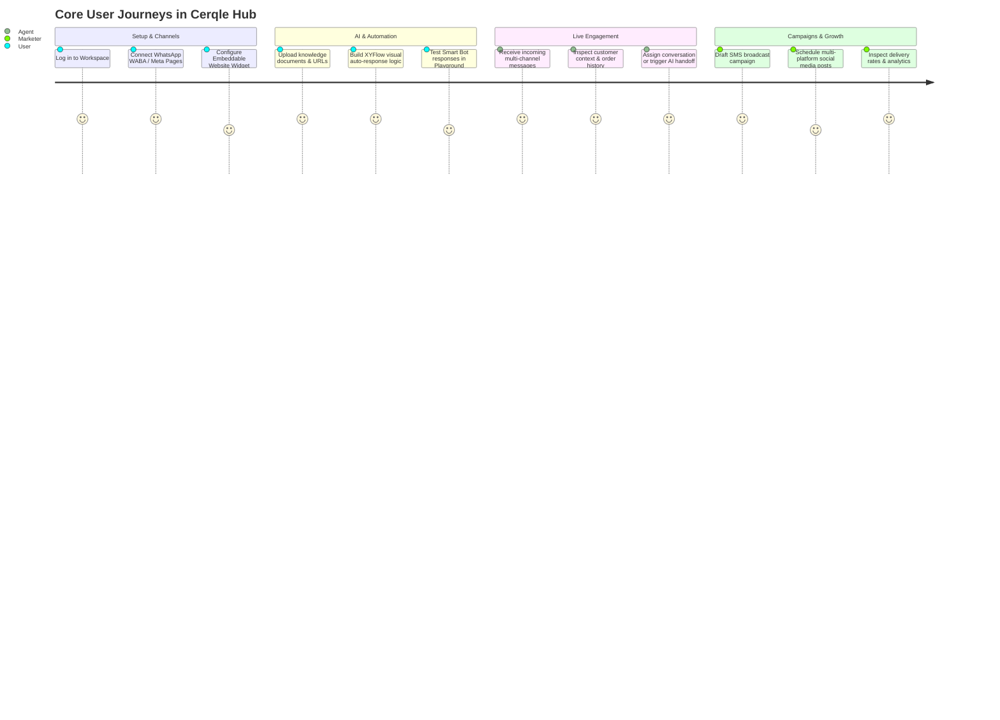

# Cerqle Hub — Implementation Plan & Feature Specifications

## 1. Purpose & Product Vision

**Cerqle Hub** is an enterprise-grade, omni-channel customer messaging, AI automation, and engagement SaaS platform. It centralizes customer conversations across WhatsApp, Meta Messenger, Instagram DMs, Website Chat, Telegram, and Email into a single unified agent workspace, augmented with autonomous AI knowledge bots, visual workflow automations, and targeted SMS broadcasting.

---

## 2. Core User Journeys



---

## 3. Feature Modules & Detailed Specifications

### Feature 1: Multi-Tenancy, Auth & Team Management (`app/Http/Controllers/Client/*`)

#### Capabilities
- **Authentication & Security**: Email/password authentication, Magic Link login, Google/Socialite OAuth, and Google Authenticator 2FA (`TwoFactorController`). Google signup is available separately from Google login, requires Terms acceptance, and can create an account; Google login only admits an existing identity. Email/password registrations enter the dashboard immediately but operational features remain locked until email verification.
- **Workspace Switching**: Seamless switching between client-owned workspaces (`WorkspaceController`) with strict scoped sessions.
- **Workspace Management**: Authorized owners and client administrators can rename a workspace or permanently delete it after typing its exact name. Deletion is atomic, removes workspace-scoped records, selects a safe fallback workspace, and cannot remove the client's only workspace.
- **Client lifecycle**: Super Admin client deletion requires exact-name confirmation, permanently purges identity and operational records, anonymizes retained finance/audit rows, and releases user emails for reuse.
- **Role-Based Team Access**: Client administrators can invite team members, assign granular roles (Admin, Agent, Viewer), and inspect audit logs (`TeamController`, `ClientAuditLogController`).
- **Admin-managed notification availability (2026-09-13)**: Client administrators set Always/Scheduled/Paused for each assigned teammate/workspace from Team. Teammates view their availability in Notification Settings but cannot edit it through browser or mobile APIs. Administrators may also configure their own schedule. One window/day, all-day, overnight and timezone controls silence work emails/push/popups outside hours while retaining history/unread updates. Event and delivery must both be available; no catch-up. Security/billing bypass; existing preferences remain authoritative. No routing, assignment, presence or AI behavior changes.
- **Session Management**: View and revoke active browser sessions remotely (`SessionController`).
- **Resilient Verification Email**: Account creation succeeds even when SMTP or fallback notification delivery is rejected; failures are logged for follow-up and transactional messages include branded HTML plus a readable plain-text part.

#### Verification Criteria
- [x] Unauthenticated requests redirect to `/login`.
- [x] Workspace switching immediately re-scopes all active queries, broadcast channels, and settings.
- [x] Same-client users cannot access workspace broadcasts without ownership or explicit membership.
- [x] Permanent deletion requires exact-name confirmation, preserves a fallback workspace, and removes dependent workspace data.
- [x] Deactivating a team member terminates their active sessions immediately.

---

### Feature 2: Omni-Channel Agent Inbox & Master Email Inbox (`app/Modules/Inbox`, `app/Modules/Shared`)

#### Capabilities
- **Unified Conversation Stream (`/app/inbox`)**: Real-time conversation list filtered by folders (`All`, `Mine`, `Unassigned`, `Resolved`, `Snoozed`) and channels (WhatsApp, Instagram, Messenger, Webchat).
- **Interactive Chat Interface**:
  - Rich message formatting with image, video, audio, and document attachment previews.
  - WhatsApp image previews retry broken saved URLs through the authenticated media endpoint; image files sent as documents also display inline. Cached inbound media is streamed privately from configured storage, and uncached media uses the chat's WhatsApp phone identity rather than the workspace default. Provider-side unavailable media still requires retry/resending.
  - Canned replies (`/quick-reply`) for fast repetitive response delivery.
  - Plain-text internal agent private notes and conversation tagging. Notes do not parse teammate mentions or send mention alerts; `@` remains ordinary text. Existing notes remain intact.
  - Real-time agent typing indicators and live presence detection.
  - Opened chats offer confirmed permanent deletion from Cerqle (messages, notes, assignments, labels and widget push registrations). Contacts and original-provider messages remain; new inbound activity may create a new chat. Shared media assets and AI billing history are retained.
- **Master Email Inbox (`/app/inbox/email`)**: Dedicated multi-mailbox email client synchronizing Gmail, Microsoft 365, and IMAP/SMTP accounts with folder organization and threaded conversations.
  - **Resolve all open**: Confirmed bulk action resolves open email threads in the selected mailbox, or every connected mailbox in the current workspace. Includes all pages regardless of search/folder; pending and snoozed threads are unchanged. No email is sent or deleted. Existing resolution timestamps are preserved; the action reports the affected count.
    - Available through the mobile API too: `POST /api/v1/mobile/email/resolve-open`; optional `account_id` selects one mailbox, omission/null selects all workspace mailboxes. Mobile clients confirm scope before calling and refresh thread lists/counts afterward. Contract: [`docs/mobile-inbox-api.md`](docs/mobile-inbox-api.md).
  - **Connected mailbox allowance**: Admin Plan Limits includes `email_accounts`, shared across every workspace in the client organization (or the standalone workspace owner's workspaces). Zero blocks new mailboxes; null/missing preserves unlimited legacy plans. Inactive/error connections still count until disconnected. Downgrades retain existing mailboxes and allow same-provider identity reconnects; a different provider or workspace is a separate connection. Email Setup displays usage and a capacity warning. This is distinct from monthly sending limits.

#### UI State Machine
```text
[Incoming Message] ──► [Unassigned Folder] ──(Assign Agent)──► [Mine Folder]
                              │                                      │
                              ├────────(Trigger AI Handback)─────────┤
                              ▼                                      ▼
                      [AI Handling Turn] ◄────(2 Fails/Turn)───► [Human Agent]
                              │                                      │
                              └───────(Mark Resolved)────────────────► [Resolved]
```

---

### Feature 3: Embeddable Website Chatbot Widget (`/widget/v1/*`, `public/widgets/chat/*`)

#### Capabilities
- **Lightweight Script Loader**: Embed script (`/widgets/chat/{widgetKey}.js`) dynamically injects the Cerqle Chat Launcher onto client websites.
- **Visitor Session Isolation**: Each visitor is assigned a secure cryptographic session token. Unauthenticated visitors stay anonymous; authenticated user profiles are verified via server-side HMAC validation.
- **AI-to-Human Handoff**: Auto-engages visitors with knowledge base answers, offering a smooth handoff to live agents after 2 failed turns or explicit user request.
- **Website AI availability (2026-09-13)**: Per-widget Off/Permanent/Scheduled. Scheduled supports up to five non-overlapping windows/day, all-day, overnight, weekday copy and IANA timezone; unsaved default weekdays 09:00–17:00. AI requires receipt and send inside active hours. Off retains bot/hours and does not hide the widget or disable workflows/manual support. Human requests remain available outside hours; no catch-up replies. Existing enabled AI migrates to Permanent. Provider and concurrent-worker signoff remain separate from automated checks.
- **Custom Branding**: Configurable colors, greeting messages, avatar launcher icon, and pre-chat capture forms.
  - Custom launcher icons are included in every active paid plan, regardless of plan name or the separate white-label flag (2026-09-07). Free/no-plan/expired clients retain the default launcher. Paid classification uses the plan's configured monthly/yearly prices, including legacy monthly price fallback; quota and other explicit feature limits are unchanged.

---

### Feature 4: WhatsApp Cloud API & Template Manager (`app/Modules/Whatsapp`)

Coexistence is available to all clients when the installation-wide onboarding switch
is enabled (owner decision 2026-09-15); no workspace allowlist applies. Both Connect
WABA and WhatsApp Business App are shown in the drawer. If the global switch is off,
Business App is disabled with an explanation while WABA remains available. Initial
safety work prevents an OAuth interaction longer than 15 seconds from losing its
session selection, rejects cancelled/mismatched signup completion, and separates
non-live webhook fields from live ingestion. Remaining implementation and live
validation gates are tracked in `WHATSAPP_COEXISTENCE.md`. The new-messages-only
coexistence implementation retains a disabled-by-default installation switch;
history/contact import is not enabled. Feature availability is platform-wide, but
accounts, onboarding attempts, quotas and messages remain workspace-isolated.
Real number eligibility and end-to-end provider delivery remain separately verified.

#### Capabilities
- **Meta Embedded Signup**: Direct WABA account onboarding and phone number registration via Meta Embedded Signup flow.
- **Template Lifecycle Management**: Create, submit for Meta approval, and synchronize WhatsApp Message Templates (Header, Body, Buttons, Parameters).
- **Keyword Auto-Replies**: Rule-based automated responses triggered by inbound keyword patterns.
- **Media Messaging**: Inbound and outbound support for interactive buttons, list messages, documents, location pins, and voice notes.

---

### Feature 5: Social Media Publisher & Scheduler (`app/Modules/Social`)

#### Capabilities
- **X publishing**: Super Admin configures/funds the shared X OAuth app; clients connect their own accounts. Internal network slug remains `twitter`. Standalone text (280 weighted characters), up to four uploaded JPEG/PNG images (5 MB each), or one uploaded H.264/AAC MP4 (500 MB/140 seconds) can publish immediately or on the existing scheduler. Text URLs are rejected, not silently stripped; other destinations may retain links through overrides. X uses existing social account/post plan limits without a separate allowance, surcharge or credits UI. Threads, engagement, analytics, Premium long posts and remote X edit/delete are deferred. Real delivery requires provider verification.
- **Connected Accounts**: Connect Facebook Pages, Instagram Business Accounts, and LinkedIn profiles via OAuth 2.0.
- **Persistent OAuth Connections**: YouTube uses the minimum sufficient `youtube.force-ssl` permission. YouTube, TikTok, and LinkedIn refresh short-lived access tokens automatically before use and on a ten-minute schedule. Application deployments preserve encrypted refresh tokens, and transient refresh failures never remove or disable a client connection. The dedicated Google Sign-In OAuth client takes precedence on the login page; legacy Firebase Google authentication remains a fallback only when that client is unavailable.
- **Multi-Platform Post Composer (`/app/social/composer`)**: Compose copy, attach media, preview platform-specific layouts, and publish immediately or schedule for future delivery.
- **Platform-Specific Payloads**: A shared base post can be overridden per selected network. Provider-only fields (YouTube metadata and TikTok creator privacy/interaction consent) are validated independently without conflating capabilities.
- **Temporary Publishing Media**: Social uploads count against plan storage while active or retryable, are released from quota after all destinations publish, and are purged after a 24-hour safety window.
- **Reliable Post Previews**: Scheduled and retryable post cards use stored MIME metadata to render uploaded videos as video-frame previews and images as images. Unavailable media uses a neutral placeholder instead of a broken browser image.
- **Social Upload Limits**: Social images accept up to 25 MB, social videos accept up to 500 MB, and YouTube thumbnails retain their 2 MB provider limit. These application limits are identical across environments; deployment templates align PHP-FPM and Nginx with a 520 MB multipart request ceiling for video.
- **Storage Visibility**: The Subscription page and subscription APIs report organization-wide used, remaining, percentage, unlimited, and full storage states.
- **Plan activation and enforcement**: Even a zero-cost plan must be explicitly activated. No-plan users can access only dashboard, billing/subscription, pricing, profile/settings, verification, and logout. Expired plans are read-only: inbound data continues, while outbound actions, mutations, scheduled social publishing, campaigns, and automations pause until renewal.
- **Interactive Visual Calendar (`/app/social/calendar`)**: Month/Week/Day calendar view for managing scheduled and past social media campaigns.
- **Capability-Driven Deletion**: Safely distinguishes remote platform deletion capabilities between Facebook (supported) and Instagram (API limited).

---

### Feature 6: AI Knowledge Bases & Autonomous Smart Bots (`app/Modules/AI`)

#### Capabilities
- **Multi-Source Knowledge Ingestion**: Ingest raw text, PDF/Word documents, website URL crawlers, and XML sitemaps into vectorized embeddings (`IndexKnowledgeDocumentJob`).
- **Hybrid Vector Retrieval**: Built-in MySQL vector-like similarity fallback with high-performance Qdrant vector database support.
- **LLM Provider Agnostic**: Native support for OpenAI, Anthropic, Google Gemini, and DeepSeek frontier chat models. DeepSeek can be selected for lower-cost RAG answer generation while OpenAI or Gemini supplies the embeddings required for indexing and retrieval.
- **Smart Bot Configuration**: Define persona prompt instructions, confidence thresholds, temperature, and fallback behaviors.
- **Grouped AI Automation**: Channel Setup groups WhatsApp/Instagram/Messenger; Email Setup independently groups mailboxes. Owners/admins select Off, On or Scheduled and an enabled workspace chatbot. Weekly hours support one window/day, all-day and overnight in an IANA timezone. No saved group means legacy account assignments; explicitly saving supersedes them, including future accounts. Human takeover precedes workflows, reply rules and queued AI. Outside hours no reply backlog is created. AI jobs discard messages older than ten minutes and recheck mode/revision, hours, sender and subscription before sending.
- **Email AI safety**: Fresh incoming new/existing unassigned threads can receive AI; default human triage is not explicit assignment. Manual replies, assigned users and handover markers stop AI until explicit handback. Initial imports, pre-activation messages, self/automated/list/bounce mail and attachment-only messages are suppressed. Replies pin the originating mailbox/message/thread and recipient with no automatic CC/BCC. Delivery failures are visible failed conversation entries and ambiguous attempts require review, never automatic resend. Designated provider delivery and concurrent-worker verification remain release gates.

---

### Feature 7: Visual Workflow Automation Builder (`app/Modules/Automation`)

#### Capabilities
- **Drag-and-Drop Node Canvas**: Interactive node-graph builder powered by **XYFlow / React Flow** (`/app/automations/builder/{id}`).
- **Initial creation catalog (2026-09-13, revised after audit)**: WhatsApp Message Received scoped to an explicit workspace-owned WABA/phone channel, with optional keywords. Only SEND is exposed: Send WhatsApp, Send Template, Send Media and Quick Replies. All LISTEN, LOGIC, CONTACT, ENGAGE, COMMERCE and INTEGRATIONS nodes are removed from new-flow creation. Previously deferred SEND actions remain hidden. Stored nodes/configuration and their execution handlers are preserved; removing a creation option does not delete existing workflows or independently alter their activation rules. Existing hidden nodes carry a legacy warning.
- **Support interactions**: Quick Replies wait for a valid choice (`context.choice` and stable `context.choice_id`, `btn_1`–`btn_3`). Questions wait for a nonempty textual reply to the same chat/account, saving a configured variable. Question timeout is configurable from 1–168 hours, default 24; menu timeout is 24 hours. A consumed reply does not start the same automation again. Human assignment ends the run.
- **Validation and preview**: Shared graph/configuration validation blocks cycles, dangling/unreachable nodes, ambiguous edges, incomplete conditions and terminal waits/questions/menus. Drafts may be incomplete. Activate saves and validates the reviewed canvas atomically. Preview accepts sample message/answer and has no sends, writes, AI charges or external calls; it does not prove delivery.
- **Follow-ups**: Runs pin workflow version, original conversation and sending account. Every send rechecks account/phone availability, consent and human takeover; workers recheck subscription/workflow status. Non-template sends require an open WhatsApp service window. Initial templates support positional body parameters and static headers/buttons only; templates requiring media/dynamic headers, dynamic buttons or voice calling fail closed until a dedicated parameter UI is added.
- **Execution Engine**: `ExecuteAutomationRunJob` uses per-run overlap protection, durable delayed wakeups, stale-wakeup guards, unique inbound/reply receipts and per-node attempt claims. Ambiguous crashed sends require delivery review, never automatic replay. Migration cancels unsnapshotted legacy waiting/running runs for review. Provider end-to-end signoff remains required; see [`docs/automation-sqa.md`](docs/automation-sqa.md).

---

### Feature 8: Campaigns & SMS Gateway Connector (`app/Modules/Broadcasting`)

#### Capabilities
- **Pluggable SMS Gateways**: Pre-integrated drivers for Twilio, MessageBird, SMSBD, REVE SMS, BulkSMS BD, ProSMS (Alaris), and Amazon SNS.
- **Segmented Campaigns**: Dispatch targeted SMS broadcasts to dynamic contact segments or real browser CSV uploads. Campaign CSVs use the same configured file-size and per-file row ceilings as Contact List imports, are validated before selection, and are stored in a workspace-scoped campaign path.
- **WhatsApp Campaigns**: Dispatch approved Meta templates from an explicitly selected workspace-owned WABA and active phone number. The launch and send paths revalidate WABA, phone, channel and template ownership; require WhatsApp consent; and retain scheduling, staged pacing, pause/resume, monthly message limits and webhook delivery reporting.
- **Campaign Cloning**: Clone any campaign into a reviewable draft that preserves its channel, provider/sender, audience, content and delivery plan without copying recipients, delivery history, progress or schedule. CSV audiences receive an independent file copy.
- **Rate Limiting & Queue Batching**: Throttled chunk dispatching on the `broadcast` queue to comply with carrier rate limits.
- **Delivery Callbacks**: Real-time SMS status tracking (Queued, Sent, Delivered, Failed) with cost metering.

---

### Feature 9: E-Commerce Store Integration (`app/Modules/Ecommerce`)

#### Capabilities
- **Store Connectors**: OAuth connectors for Shopify, WooCommerce, and BigCommerce stores.
- **Contextual In-Chat Customer Widget**: When an agent chats with a customer, their active cart, recent order numbers, fulfillment status, and total lifetime spend display in the side panel.
- **Automated Abandoned Cart Recovery**: Ingests store events to trigger automated recovery messages via WhatsApp.

---

### Feature 10: Subscriptions, Add-ons & Developer Platform (`app/Http/Controllers/Client/*`)

#### Channel allowances (2026-09-07)
- `messaging_channels` replaces the WhatsApp-only account limit. Each connected WhatsApp phone number, Messenger Page, or Instagram messaging account uses one slot, pooled across the billing organization's workspaces. These are the currently implemented Messaging Channel Setup integrations; email and website chat are separate.
- `website_widgets` limits Website Widgets; `whatsapp_chatbots` limits the **WA Chatbot** click-to-chat widgets. These are independent from `chatbots` (AI Smart Bots).
- `social_accounts` is enforced at OAuth persistence, including multi-Page connections. Reauthorization does not use another slot. Bulk callbacks retain successful connections and report accounts skipped at capacity.
- Inactive resources still count. Deletion/disconnection frees a resource slot. Downgrades do not delete resources or block editing/reauthorization, but prevent additional resources. Zero blocks creation; missing/null preserves unlimited legacy plans; no plan allows no new resources.
- `messaging_messages_per_month` pools outbound WhatsApp/Messenger/Instagram messages across all workspaces, including API, bot, automation and campaign sends through their transports. Incoming messages, read receipts, email, and website-chat messages do not count. Each provider message counts (an image plus a separately sent caption is two). Definitive failures refund; ambiguous network timeouts retain usage conservatively. Calendar-month reset uses application time, not a subscription-anniversary reset.
- Existing WhatsApp limit values seed the new keys without widening finite plans; existing current-month sent/read/delivered history seeds message usage, using the greater of WhatsApp history and its old campaign meter. New widget limits default to unlimited until explicitly configured by an administrator. Migration should run with outbound workers paused during deployment.
- Relevant setup, widget creation/edit, social and inbox pages show `used/limit` and remaining allowance across all workspaces. Email Setup uses the same compact strip, showing its independent mailbox allowance.

#### Capabilities
- **Tiered Plans & Usage Metering**: Automated enforcement of contact limits, monthly message quotas, AI vector tokens, and team member capacity.
- **Self-Service Checkout**: Automated billing and invoicing via Stripe, PayPal, and Paddle.
- **Developer Tools Add-on**:
  - API Token generator with scoped permissions for REST APIs (`/api/v1/*`).
  - Outbound Webhook Endpoints with secret rotation and delivery logs (`/app/webhooks`).
  - Interactive OpenAPI/Swagger documentation (`/app/api-docs`).

---

## 4. Testing & Verification Matrix

| Module / Area | Test Type | File Reference | Coverage Target |
| :--- | :--- | :--- | :--- |
| **Workspace Scoping** | Feature | `tests/Feature/WorkspaceScopingTest.php` | 100% tenant isolation across models. |
| **WhatsApp Ingestion** | Feature | `tests/Feature/WhatsAppWebhookTest.php` | Signature validation, message storage & Echo broadcast. |
| **Widget HMAC Auth** | Feature | `tests/Feature/WidgetSessionTest.php` | Anonymous vs HMAC signed visitor flows. |
| **Automation Runner** | Unit / Feature | `tests/Feature/AutomationExecutionTest.php` | Branch evaluation, delays & step transitions. |
| **Navigation & Layout** | Component | `resources/js/__tests__/useClientNav.test.jsx` | Sidebar permission filtering & route active states. |
| **Contact Operations** | Unit | `resources/js/__tests__/contactListOperations.test.js` | Filtering, segment selection & bulk mutations. |
| **Stripe / Billing** | Feature | `tests/Feature/BillingWebhookTest.php` | Subscription renewals, plan changes & cancellations. |
# Managed AI credit lifecycle (implemented 2026-09-02)

- Plan limit: required finite `ai_credits_per_month`; price-based rollout grants $0/$20/$40/$150 plans 100/1,000/3,000/15,000 credits and defaults every other existing plan to zero pending an admin decision.
- Rates version `2026-09-01`: RAG, subject suggestions, short rewrites, and automation AI steps cost 1; complete emails and single social posts cost 2; workflows and multi-post plans cost 5. Provider tests, embeddings, failures, cancelled reservations, and internal retries cost zero.
- Credits reset monthly on the subscription anniversary, never roll over, and remain pooled across all organization workspaces. Current-period upgrades may only increase the granted allowance; downgrades do not claw credits back.
- At 80%, clients receive an amber warning. At exhaustion, managed actions return `402 / ai_credits_exhausted` when enforcement is enabled. `auto_fallback` uses an enabled, connection-tested workspace BYOK provider; otherwise the action pauses with reconnect guidance.
- Failed chatbot generation preserves inbound data and uses the chatbot fallback reply. Automation errors remain retryable. Ledger reconciliation refunds abandoned reservations after ten minutes.
- Free managed usage requires a verified email. Request velocity, model context limits, and organization-wide atomic reservations form the initial abuse boundary; raw prompts are not written to analytics logs.
- Rollout order: shadow ledger, two-week measurement, configure allowances/privacy disclosures, warnings and mode controls, then `AI_CREDITS_ENFORCED=true`. Re-evaluate rates and allowances after 60–90 days.
